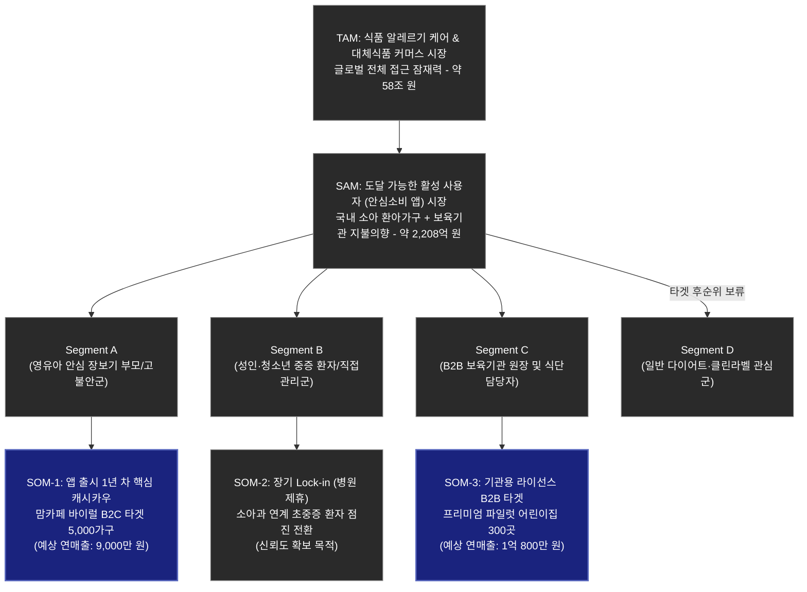

# 알레르기 안심 바코드 앱 (SafeBite) 핵심 TAM-SAM-SOM 시장 기회 분석

## 1. 시장 규모 요약 (TAM-SAM-SOM)

| 구분 | 의미 | 기획(1~7단계)을 반영한 **[알레르기 바코드 앱]** 맞춤형 시장 규모 (원화 / USD) | 시장 규모 산정을 위한 구체적 데이터 출처 |
| :---: | :--- | :--- | :--- |
| **TAM** (Total Addressable Market) | **전체 시장 규모** - 이론적으로 무한 매칭이 가능한 전체 수요 | **💸 약 58조 원 / $43.6 Billion USD** **[글로벌/국내 식품 알레르기 케어 및 Free-from 커머스 전체 시장]** • 2025년 기준 글로벌 Free-from(대체/안전) 식품 시장 (CAGR 7.7% 초고도 성장) • 미세먼지 및 서구화로 인해 소아 유병률이 평균 7~8%에 다다르는 전체 환아 생태계 잠재력 | • 미국 FARE(식품알레르기연구교육기구) 거시 지표 • 글로벌 Statista 식품 산업 추산 수치 • 보건의료빅데이터 거시 통계 |
| **SAM** (Serviceable Available Market) | **유효 시장** - 우리 솔루션(바코드 앱)이 현실적으로 서비스 도달 가능한 영역 | **💸 약 2,208억 원 / $166 Million USD** **[국내 0~12세 소아 알레르기 가구 및 보육기관의 안심 소비/구독 유효 시장]** • **B2C 유효 시장 규모:** 최근 10년 새 400% 폭증한 아나필락시스 환자군 위주 약 35만 가구의 연간 '안심 대체식품' 추가 지출 의향액 합산 (가구당 연 60만 원 산정) • **B2B 유효 시장 규모:** 외부 사고 발생 위험이 가장 큰 전국 3만 곳 보육시설 전체의 라이선스 구독 잠재 규모 | • 건강보험심사평가원 0~9세 환자 지표 • 통계청 0세~12세 인구 및 보육기관 현황 • B2C 가구당 연간 유아 간식 시장 지출 여력 산정치 |
| **SOM** (Serviceable Obtainable Market) | **수익 시장 (1년 차)** - 현재 기획과 리소스로 당장 단기 점유/매출 시뮬레이션이 가능한 타겟 | **💸 약 1.98억 원 / $150,000 USD** **[앱 런칭 1년 차 B2B/B2C 초기 거점 타겟(Beachhead) 목표 매출]** • **B2C 대상 (9,000만 원 / $68K):** 타임 푸어(Time-Poor) 워킹맘 초기 유저 5,000가구 락인 후 앱 내 '대체식품 제휴 구매(월 3만 원, 수수료 5%)' 전환분 • **B2B 대상 (1억 800만 원 / $82K):** 학부모 안심 확보 마케팅을 위해 유료 라이선스(월 3만 원)를 선도적으로 도입할 상위 1% 프리미엄 어린이집 300곳 | • 맘카페 설문조사 및 맘톡방 바이럴 초기 전환율 전망 • 육아정책연구소(KICCE) 프리미엄 보육기관 현황 • 유통물류진흥원 오픈 API 구동 비용 대비 마진 기준 |

---

## 2. 마켓 세그먼트 타겟팅 다이어그램

### 📊 알러지 안심 바코드 앱 : 4분면 세그먼트 매트릭스 (2x2 Matrix)

**X축: 행동의 주 동기 (Primary Action Motive)**

| Y축: 치명도 / 위협 절박성 (Fatality / Threat Level) | 내재적 / 자발적 (Intrinsic / Proactive) "내 생존/신념을 위해 스스로 필요" | 외재적 / 과제적 (Extrinsic / Task-Driven) "육아/보육 등 주어진 책임 완수를 위해 필요" |
| :--- | :--- | :--- |
| **높음 (High)** 생명 직결 및 비가역적 피해 | **Q1: "능동적 생존자" (Segment B)** - 특징: 생명과 직결되어 주도적 위험 회피. 단, 가족에 비해 개별 통제력이 분산되어 지불 절박함은 다소 약함. - 규모: 점진 유입 (약 1,000명) - 전략: **[의료 특화 / 권위(Authority) 타겟]**  환우회 지속 바이럴 및 전문의 제휴로 '의료 특화 알고리즘' 진정성 및 신뢰 구축.  *(SOM-2 포함)* | **Q2: "과제 수행자 / 맹목적 보호망" (Segment A)** - 특징: 내 아이를 돌봐야 하는 의무와 대체 불가능한 공포. 문제 해결을 위한 지불 수용성이 최고 수준. - 규모: 우선 타겟 (5,000가구) - 전략: **[핵심 과금 / 볼륨(Volume) 타겟]**  일일 스캔 '하드리밋' 및 '빠른 판별' 마케팅으로 즉각적 구독 전환 및 매출 확보.  *(SOM-1 포함, 연 9천만 원 수익)* |
| **낮음 (Low)** 행정/가치 목적 및 편의 향상 | **Q3: "가치 지향 소비군" (Segment D)** - 특징: 다이어트, 클린라벨 등 기호 소비. 결과 오류 시 치명적이지 않아 앱 충성도/결제율이 극도로 낮음. - 규모: N/A (거시적 확장은 가능하나 현재 배제) - 전략: **[1차 타겟 제외]**  오거닉 콘텐츠로 인식 개선만 유도. 중증 코어 시장 완전 점유 후 장기적 확장 고려 대상.  *(SOM 제외)* | **Q4: "시스템 방어자" (Segment C)** - 특징: 수기 식단표 작성의 번거로움과, 돌발 사고 시 원장이 져야 하는 행정(법적) 징계/클레임 리스크 헷지 목적. - 규모: 1년 차 학부모 안심 파일럿 도입 (300곳) - 전략: **[장기 거점 / 통신망 락인 타겟]**  나이스 API 식단 자동 매칭으로 이탈 비용이 압도적으로 높은 B2B 구독 시스템 공략.  *(SOM-3 포함, 연 1.08억 원 수익)* |

 

### 💡 매트릭스를 통한 도출된 3가지 핵심 전략 시사점 (Action Items)

1. **지갑을 여는 핵심 동력(페이월)은 철저히 'Q2, Q4(외재적 과제 수행자)'에 집중되어 있습니다.**
   1년 차 목표 재무 성과(SOM-1, SOM-3)는 모두 우측 방어망 영역에 존재합니다. 즉, 스스로를 지키는 내재적 집단(좌측)보다 **"통제할 수 없는 아이나 원아를 대신 보호·관리해야 하는" 보호자(Q2)나 원장(Q4)**의 지불 의향(WTP)이 압도적으로 높습니다.

2. **권위는 '상단(도출된 생존 알고리즘)'에서 얻어, '하단'으로 시장 파이를 흡수합니다.**
   알고리즘의 무결성은 아나필락시스의 공포와 사투를 벌이는 상단(Q1, Q2)에서 우선 확보해야 합니다. 이곳에서 완성된 무결성을 바탕으로, 향후 보육기관(Q4)이나 가치비건 소비군(Q3)으로 쉽게 영역을 확장하고 락인할 수 있습니다.

3. **기능 개발의 선택과 집중 (과감한 리소스 배제)**
   초기 단계에서는 Q3(클린라벨/단순 웰빙)가 요구하는 화려한 큐레이션 기능 개발은 과감히 버려야 합니다. 오직 Q2 대상 **[0.5초 즉각 스캔 및 결제 하드리밋 모델]**과 Q4 대상 **[다중 학급/원아 프로필 자동 매칭 로직]** 코어 엔진에만 투자해야 합니다.

---

## 3. 타겟 세그먼트별 진입 전략 (차트 분석)

전체 시장(SAM) 대비 초기 한정된 리소스를 가장 효율적으로 분배하기 위해 다음과 같이 세그먼트별 파이프라인을 구축하여 1년 차 실제 목표(SOM)를 달성합니다.

* **🎯 Segment A ➡️ SOM-1 (핵심 B2C 캐시카우)**
  * **타겟:** 영유아 안심 장보기 부모 및 고불안군
  * **전략/목표:** 초기 가장 폭발적인 반응을 이끌어 낼 수 있는 핵심 타겟입니다. 맘카페 등의 커뮤니티 바이럴을 통해 초기 B2C 유저 5,000가구를 서비스에 안착(Lock-in)시키며, 장보기 대체식품 제휴 등을 통해 **연 9,000만 원의 수익 창출**을 기대합니다.
* **🎯 Segment C ➡️ SOM-3 (안정적 B2B 구독망)**
  * **타겟:** B2B 보육기관 원장 및 식단 담당자
  * **전략/목표:** 앱 런칭 1년 차에 투트랙(Two-Track)으로 진행되는 기관 타겟팅입니다. '안심 보육 환경'이라는 차별화된 학부모 마케팅 포인트를 소구하여, 프리미엄 파일럿 어린이집 300곳을 선점하고 월정액 방식의 유료 라이선스 도입을 통해 **연 1억 800만 원의 고정 수익**을 창출합니다.
* **🩺 Segment B ➡️ SOM-2 (전문성 및 신뢰도 확보)**
  * **타겟:** 성인·청소년 중증 환자 및 본인 직접 관리군
  * **전략/목표:** 1년 차에 직접적인 대규모 수익을 견인하기보다는 서비스의 '의료적 전문성과 신뢰도'를 입증하기 위한 전략적 타겟입니다. 소아과 및 알레르기 전문 병원과 연계하여 중증 환자들을 서비스로 점진 전환시켜 장기적인 생태계를 구축합니다.
* **⏳ Segment D (타겟 후순위 보류)**
  * **타겟:** 일반 다이어트 및 클린라벨 관심군 (비건 등)
  * **전략/목표:** 거시적으로 접근 가능한 큰 시장이지만, 알레르기라는 확실한 'Pain-point'가 있는 Segment A, C 대비 긴급성이 떨어지므로 초기 기획 집중을 위해 타겟 후순위로 보류합니다. 코어 타겟 시장(초중증 고불안군)을 확실히 점유한 이후 확장 파이프라인으로 활용합니다.

---

## 4. 💡 (참고) 최종 SOM 시뮬레이션 산출 근거

위의 핵심 진입 전략 중 실질적인 매출을 견인하는 **SOM-1**과 **SOM-3**을 기반으로 한 1년 차 수익 시뮬레이션입니다. (7단계 액션 플랜 반영)

1. **B2C 커머스 제휴 수익 (SOM-1):** 5,000가구 × 월 3만 원 추천 결제 × 5% 제휴 수수료율 × 12개월 = **연 약 9,000만 원 ($68,000 USD)**
2. **B2B 보육기관 구독 수익 (SOM-3):** 프리미엄 300개 원 × 월 3만 원 기관 통제용 라이선스 구독료 × 12개월 = **연 약 1억 800만 원 ($82,000 USD)**
3. **1년 차 총 예상 SOM (매출):** **연간 약 1.98억 원 / $150,000 USD (초기 생존 캐시카우 확보 모델)**
