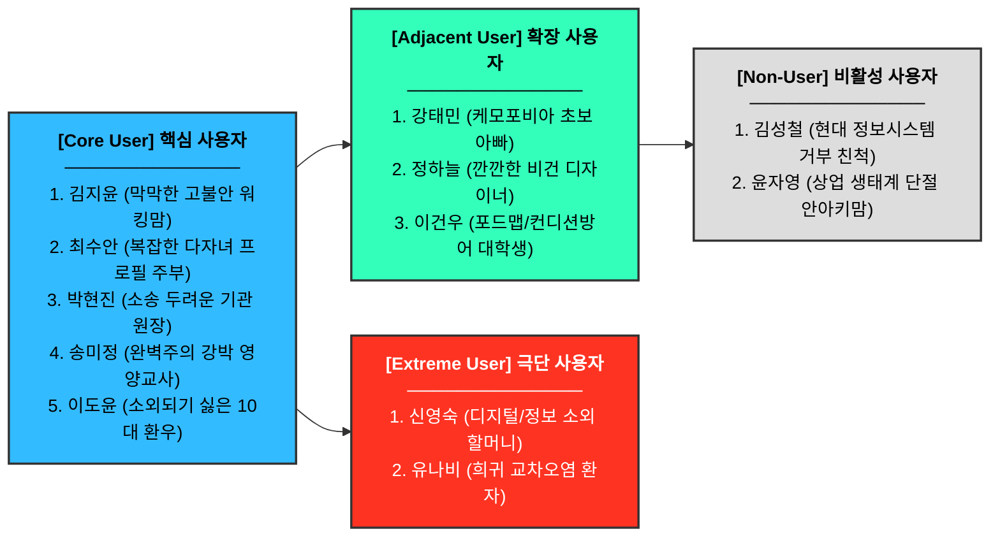
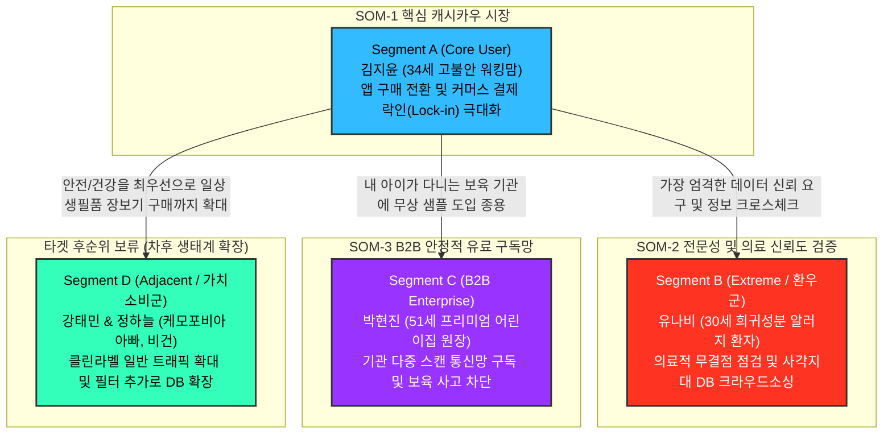

# 👥 알러지 케어 및 생명 안심 바코드 앱(SafeBite) 페르소나 스펙트럼

---

## 1. 페르소나 요약 관계도 (Diagram)

---

## 2. 페르소나 스펙트럼 종합 매트릭스 테이블

| 이름 | 직무/역할 | 겪는 문제 (Problem) | 목표 (Goal) | 감정 (Emotion) | 현재 대체 솔루션 |
| :--- | :--- | :--- | :--- | :--- | :--- |
| **김지윤** (34세) | 5세 아나필락시스 심멎 환아 워킹맘 **(Core - Q2 맹목적 보호망)** | 퇴근 후 짧은 마트 쇼핑 시간에 아이 간식을 골라야 하는데, 깨알 같은 텍스트와 숨겨진 교차오염 우려를 직접 확인하기가 막막합니다. | 0.5초 스캔 만에 안심 간식을 100% 판별하고, 어린이집에 돌발 쇼크 대처 SOS 매뉴얼을 앱 연동으로 즉각 공유하는 것. | 극도의 불안, 압박감, 번아웃 | - 맘카페 및 블로그 후기를 일일이 검색 - 이미 성분을 외운 안전 과자 2~3개만 반복 구매 |
| **최수안** (39세) | 다자녀 복합 알러지 전업주부 **(Core - Q2 맹목적 보호망)** | 첫째는 갑각류, 둘째는 유제품 알러지로 서로 항원이 달라, 매일 장을 볼 때마다 식품 정보를 이중으로 대조해야 하는 피로감이 큽니다. | 앱스위칭 없이 복잡한 우리 아이들 2명의 프로필을 동시 매칭해 '두 아이 일괄 안전 식품'인지 한 번에 확인하는 것. | 강박, 육체적 피곤함, 노심초사 | - 자녀별 간식 보관함을 물리적으로 엄격히 분리 - 같은 간식이라도 성분을 달리해 이중으로 구매 및 조리 |
| **박현진** (51세) | 150명 규모 프리미엄 어린이집 원장 **(Core - Q4 시스템 방어자)** | 수기 급식 기록만으로는 교사 배식 실수를 100% 막을 수 없어, 돌발 사고 시 소송이나 폐원으로 직결될 수 있는 치명적 경영 리스크가 존재합니다. | B2B 다중 스캔 통신망을 전격 도입하여 행정 오류를 차단하고, 학부모들에게 '안심 보육 환경'이라는 명확한 마케팅 신뢰를 주는 단단한 기반을 확충하는 것. | 막연한 두려움, 책임감, 행정적 부담 | - 영양사가 매일 수기 식단표의 위험 물질에 형광펜 칠 - 아침마다 각 반 담임교사에게 수시로 구두 주의 전달 |
| **송미정** (45세) | 800명 규모 초등학교 영양교사 **(Core - Q4 시스템 방어자)** | 나이스(NEIS) 식단표와 800명 전교생의 개별 체질을 매일 수동 대조하며, 1g의 교차오염 사고도 허용되어선 안 된다는 압박이 있습니다. | 나이스 식단과 학생 체질을 자동 알고리즘으로 매칭해, 위험 요소만 걸러 담임의 모바일 뷰로 매일 아침 전송하여 행정 오류를 제로화하는 것. | 극심한 완벽주의, 업무 과중, 강박 | - 공공 엑셀 파일을 다운받아 수동 VLOOKUP 함수 처리 - 급식실 배식구 타일에 환아 얼굴 사진과 명단 테이핑 부착 |
| **이도윤** (16세) | 중증 환우본인, 고등학생 **(Core - Q1 능동적 생존자)** | 하교 후 편의점에서 친구들과 튀는 신상 간식을 먹고 싶지만, 알러지 정보가 확실치 않아 항상 눈치 보며 혼자 굶어야 합니다. | 남들에게 유난 떠는 것처럼 보이지 않게 눈치 채기 전 1초 만에 성분을 파악하고 결제하여 또래 문화에 힙(Hip)하게 섞이는 것. | 위축감, 소외감, 짜증 | - 의심스러운 편의점 신상 간식은 아예 단념 - 화장실에 몰래 가서 환우 카톡방에 사진을 올려 유무를 물어봄 |
| **강태민** (32세) | 케모포비아 성향 초보 아빠, 회사원 **(Adjacent - Q3 가치 지향)** | 아이 피부에 무리가 가는 자극적 화학 첨가물을 차단하고 싶지만 너무 교묘한 화학 성분 용어들을 일반인으로서 구별하기 힘듭니다. | 알러젠뿐 아니라 '유해 첨가물 신호등 지수'까지 한 번에 스캔해, 결벽증에 가까울 정도로 완벽무결한 무첨가 제품을 골라내는 것. | 불신, 의심, 과도한 예민함 | - 극유기농 전용 오프라인 매장(한살림 등)만 고집하여 이용 - 시중 마트 제품은 아예 스킵하고 가장 비싼 제품 일괄 맹신 구매 |
| **정하늘** (27세) | 깐깐한 비건 프리랜서 디자이너 **(Adjacent - Q3 가치 지향)** | 돈지나 동물성 카민 색소 등 교묘하게 숨은 2차 오염 원료를 전문가만큼 알지 못해, 의도치 않게 비건 소비 신념이 자꾸 꺾입니다. | 알레르기 필터링 기능을 역이용해 유해물과 동물성 원료 오염 여부를 제품 뒷면을 읽는 과정 없이 즉각 검수하는 것. | 기업에 대한 환멸, 짜증, 혼란 | - 수입 비건 전용 온라인 커머스 브랜드만 고집 - 이미 비건 커뮤니티에서 검증이 종결된 한정판 화이트리스트에만 의존 |
| **이건우** (23세) | 과민성 장 질환(포드맵) 관리 대학생 **(Adjacent - Q3 가치 지향)** | 유당이나 글루텐 등 잘못 섭취 시 피부와 장이 뒤집어지지만, 병원 응급행 수준의 위험은 아니어서 매번 앱을 켜고 식단을 확인하기가 귀찮습니다. | 머리 아프게 성분표를 일일이 분석할 필요 없이, 바코드 스캔 루틴만으로 내일 컨디션을 망치는 치명적 기피 성분만 쏙 걸러내는 것. | 지루함, 지독한 귀찮음, 피로감 | - 귀찮으면 일단 그냥 먹고 다음날의 배탈과 속 쓰림을 감수 - 사후 처방으로 속이 안 좋을 때 약국 소화제 및 항히스타민제 복용 |
| **신영숙** (68세) | 황혼 육아 전담 조부모님 할머니 **(Extreme - 디지털/정보 소외)** | 심한 노안으로 가공식품 뒷면의 깨알 같은 알레르기 경고 문구를 전혀 읽을 수 없으며, 스마트폰 회원가입 및 뎁스 조작이 불가합니다. | 회원가입 과정 없이 앱 화면 정중앙에 큰 극단적 기호(O, X)나 진동 효과로 '이걸 먹여도 문제없는지' 초직관적인 통보를 받는 것. | 폰 오조작에 대한 공포, 무서움, 좌절감 | - 며느리가 출근 전 미리 통에 담아 싸준 지정 간식 통 이외에는 일절 배식 금지 - 새로운 시판 마트 과자를 자체 판단하여 사주는 행위 자체를 거부함 |
| **유나비** (30세) | 희귀 교차오염 피부 질환 환자 **(Extreme - 데이터 생태계 이탈)** | 식약처 의무 표기 대상 22종이 아닌, 희귀 미세 원료 교차오염에 피부/기도가 반응하여 시중 데이터나 기존 앱으론 필터링이 불가능합니다. | 앱 내 제보 기능(크라우드소싱)을 통해 본인이 발굴한 성분 블랙리스트를 등록하고, 동일 희귀 성분 환우회와 데이터를 사설로 공유하는 것. | 고립감, 사각지대 돌파, 분노 | - 식품 구매 전 제조사 고객센터 팀에 원료를 확인하는 전화 매번 소요 - 본인만의 팩트를 정리한 거대한 수기 엑셀 블랙리스트 시트 구축 |
| **김성철** (55세) | 기성세대 아날로그 자영업 친척 **(Non-User - 기성 시스템 고수)** | 알레르기를 그저 젊은 엄마들의 '유별난 편식'으로 취급하여, 화학 성분 확인 카메라 시스템 자체를 쓸 필요가 없다고 전면 거부합니다. | 상표나 성분에 구애받지 않고 시장 과자 등 당장 맛있는 것을 마음껏 먹여야 아이 면역력이 길러진다는 낡은 기성세대의 신념을 주변에 관철하는 것. | 스마트 육아 세대에 대한 답답함과 반항심 | - 성분 바코드 확인 없이 아이 입에 자극적인 초콜릿과 과자를 그냥 밀어 넣음 - *(엄마 사용자가 "앱 비추천 판정 떴다"라며 갈등 방어용 무기로 삼을 대상)* |
| **윤자영** (37세) | 안아키 맘 및 극단 자연식주의자 **(Non-User - 상업 생태계 거절)** | 바코드가 박혀 있는 시판 가공식품 생태계 자체를 통째로 악으로 간주하고, 자발적으로 단절하여 앱을 통해 '스캔할 제품 자체가 없습니다.' | 현대 자본주의 상업 유통망과 화학 성분을 일절 거부하고, 밭과 뒷마당 자급자족을 통한 100% 무가공 천연 밥상을 평생 일구어 내는 것. | 상업 시스템에 대한 경멸, 혐오 | - 무가공 원물 야채 생협, 본인이 자연주의로 재배한 텃밭 채소 위주의 식단만 운용 - 대형 가공 공장의 벨트를 탄 제품은 아이의 접근 자체를 집안 현관부터 차단함 |

---

## 3. 마켓 세그먼트(SOM) × 페르소나 통합 구조도

기존 마켓 세그먼트 분석(SG1~SG4)과 도출된 핵심 페르소나 간의 유기적인 역학 관계를 나타내는 통합 다이어그램입니다. 중앙의 핵심 캐시카우를 바탕으로 시스템이 어떻게 인프라와 트래픽으로 뻗어나가는지 시각화하였습니다.

---

## 4. 확장 페르소나(Adjacent)의 도입 타당성 및 통합 전략 인사이트

### 1) 글로벌 경쟁사 벤치마킹(Value Chain)의 성공 공식

* **포드맵(FODMAP) 및 비건 확장:** 미국의 **'Fig'** 앱은 알러지를 넘어 개인화된 식단(FODMAP, 비건 등 2,800개 필터)으로 확장하여 사용자를 거대하게 락인시켰습니다.
* **케모포비아(가공식품 유해물 공포) 확장:** 미국의 **'Trash Panda'**와 프랑스의 **'Yuka'**가 수천만 다운로드를 일으킨 폭발력의 근원은 숏폼을 통한 **'유해 첨가물 공포 마케팅(Clean Label)'**이었습니다. 알러지 엔진을 기반으로 필터만 추가하면 대규모 트래픽 획득이 가능함을 선행 기업들이 이미 입증했습니다.

### 2) TAM 단계의 거대 시장(Free-from Market) 실체 확립

* 앞서 도출한 1단계 **TAM(글로벌 잠재 시장 약 58조 원 규모)** 지표의 기준이 된 것은 **'Free-from(대체/안전 식품)'** 커머스 시장 전체입니다.
* 알레르겐 무첨가(Allergen-free)뿐만 아니라, **동물성 무첨가(Vegan), 글루텐 무첨가(FODMAP), 화학물질 무첨가(Clean Label)**를 전부 아우르기 때문에 확장 페르소나 도입은 궁극적인 시장 장악을 위한 전략적 핵심입니다.

### 3) 기술 스케일아웃(Scale-out)의 압도적 효율성

* 이 확장이 매력적인 이유는 핵심 타겟(Q2)을 위해 개발한 **'NLP 텍스트 매칭 알고리즘 엔진'**을 100% 재활용할 수 있기 때문입니다.
* 서버 데이터베이스의 폴더에 `[알레르겐 22종]` 대신 `[동물성 유래 성분 N종]`이나 `[유해 첨가물 N종]`이라는 비교 리스트만 추가 업로드하면 비건/클린 라벨 앱으로 무한 확장이 가능하여 기회비용이 거의 0에 수렴합니다.

### 4) 화학적 결합: 수익 창출과 데이터 플라이휠 구조의 완성

* **수익 창출망 (엄마/원장):** B2C와 B2B를 가리지 않고, 실패 시의 치명적 피해(생명 위험, 학부모 소송, 폐원)가 두려운 **우측 계층(Q2, Q4)**의 압박감이 인앱 결제와 라이선스 매출을 견인합니다.
* **데이터 플라이휠 (환우군):** 플랫폼의 궁극적인 권위와 신뢰도 무기장착은 희귀 알러지 환자 등 극단적 사각지대에 내몰린 **좌측 계층(Q1, Extreme)**의 절실한 크라우드소싱 활동이 독보적인 비용 우위로 채워주는 선순환을 완성합니다.

---

## 5. 유형별 상세 페르소나 스펙트럼 (Detailed Profiles)

**👥 [1. 핵심 사용자 5명]**

| 이름 | 직무/역할 | 겪는 문제 (Problem) | 목표 (Goal) | 감정 (Emotion) | 현재 대체 솔루션 |
| --- | --- | --- | --- | --- | --- |
| 김지윤(34세) | 5세 아나필락시스 심멎 환아 워킹맘(Core - Q2 맹목적 보호망) | 퇴근 후 짧은 마트 쇼핑 시간에 아이 간식을 골라야 하는데, 깨알 같은 텍스트와 숨겨진 교차오염 우려를 직접 확인하기가 막막합니다. | 0.5초 스캔 만에 안심 간식을 100% 판별하고, 어린이집에 돌발 쇼크 대처 SOS 매뉴얼을 앱 연동으로 즉각 공유하는 것. | 극도의 불안, 압박감, 번아웃 | - 맘카페 및 블로그 후기를 일일이 검색- 이미 성분을 외운 안전 과자 2~3개만 반복 구매 |
| 최수안(39세) | 다자녀 복합 알러지 전업주부(Core - Q2 맹목적 보호망) | 첫째는 갑각류, 둘째는 유제품 알러지로 서로 항원이 달라, 매일 장을 볼 때마다 식품 정보를 이중으로 대조해야 하는 피로감이 큽니다. | 앱스위칭 없이 복잡한 우리 아이들 2명의 프로필을 동시 매칭해 '두 아이 일괄 안전 식품'인지 한 번에 확인하는 것. | 강박, 육체적 피곤함, 노심초사 | - 자녀별 간식 보관함을 물리적으로 엄격히 분리- 같은 간식이라도 성분을 달리해 이중으로 구매 및 조리 |
| 박현진(51세) | 150명 규모 프리미엄 어린이집 원장(Core - Q4 시스템 방어자) | 수기 급식 기록만으로는 교사 배식 실수를 100% 막을 수 없어, 돌발 사고 시 소송이나 폐원으로 직결될 수 있는 치명적 경영 리스크가 존재합니다. | B2B 다중 스캔 통신망을 전격 도입하여 행정 오류를 차단하고, 학부모들에게 '안심 보육 환경'이라는 명확한 마케팅 신뢰를 주는 것. | 막연한 두려움, 책임감, 행정적 부담 | - 영양사가 매일 수기 식단표의 위험 물질에 형광펜 칠- 아침마다 각 반 담임교사에게 수시로 구두 주의 전달 |
| 송미정(45세) | 800명 규모 초등학교 영양교사(Core - Q4 시스템 방어자) | 나이스(NEIS) 식단표와 800명 전교생의 개별 체질을 매일 수동 대조하며, 1g의 교차오염 사고도 허용되어선 안 된다는 압박이 있습니다. | 나이스 식단과 학생 체질을 자동 알고리즘으로 매칭해, 위험 요소만 걸러 담임의 모바일 뷰로 매일 아침 전송하여 행정 오류를 제로화하는 것. | 극심한 완벽주의, 업무 과중, 강박 | - 공공 엑셀 파일을 다운받아 수동 VLOOKUP 함수 처리- 급식실 배식구 타일에 환아 얼굴 사진과 명단 테이핑 부착 |
| 이도윤(16세) | 중증 환우본인, 고등학생(Core - Q1 능동적 생존자) | 하교 후 편의점에서 친구들과 튀는 신상 간식을 먹고 싶지만, 알러지 정보가 확실치 않아 항상 눈치 보며 혼자 굶어야 합니다. | 남들에게 유난 떠는 것처럼 보이지 않게 눈치 채기 전 1초 만에 성분을 파악하고 결제하여 또래 문화에 힙(Hip)하게 섞이는 것. | 위축감, 소외감, 짜증 | - 의심스러운 편의점 신상 간식은 아예 단념- 화장실에 몰래 가서 환우 카톡방에 사진을 올려 유무를 물어봄 |

**👥 [2. 확장 사용자 3명]**

| 이름 | 직무/역할 | 겪는 문제 (Problem) | 목표 (Goal) | 감정 (Emotion) | 현재 대체 솔루션 |
| --- | --- | --- | --- | --- | --- |
| 강태민(32세) | 케모포비아 성향 초보 아빠, 회사원(Adjacent - Q3 가치 지향) | 아이 피부에 무리가 가는 자극적 화학 첨가물을 피하고 싶지만 너무 교묘한 복합 화학 용어들을 일반인으로서 구별하기 힘듭니다. | 알러젠뿐 아니라 '유해 첨가물 신호등 지수'까지 한 번에 스캔해, 결벽증에 가까울 정도로 완벽무결한 무첨가 제품을 골라내는 것. | 불신, 의심, 과도한 예민함 | - 극유기농 전용 오프라인 매장(초록마을 등)만 고집하여 이용- 시중 마트 제품은 아예 스킵하고 가장 비싼 제품 무조건 확신/구매 |
| 정하늘(27세) | 깐깐한 비건 프리랜서 디자이너(Adjacent - Q3 가치 지향) | 돈지나 동물성 카민 색소 등 교묘하게 숨은 2차 오염 원료를 전문가만큼 알지 못해, 의도치 않게 비건 소비 신념이 자꾸 꺾입니다. | 앱의 알레르기 필터링 기능을 역이용해, 라벨 뒷면을 읽는 피곤하고 전투적인 과정 없이 동물성 오염 여부를 즉각 검수하는 것. | 자본 기업에 대한 환멸, 짜증 | - 수입 비건 전용 온라인 커머스 브랜드만 고집- 이미 비건 커뮤니티에서 성분 토론이 종결된 한정판 화이트리스트에만 의존 |
| 이건우(23세) | 과민성 장 질환(포드맵) 관리 대학생(Adjacent - Q3 가치 지향) | 유당이나 글루텐 등 잘못 섭취 시 피부와 장이 뒤집어지지만, 응급행 수준의 생명 위험은 아니어서 매번 앱을 켜고 식단을 확인하기가 귀찮습니다. | 머리 아프게 성분표를 일일이 분석할 필요 없이, 바코드 스캔 한 번의 루틴만으로 내일 컨디션을 망치는 치명적 기피 성분만 쏙 걸러내는 것. | 지루함, 지독한 육체적 귀찮음 | - 너무 귀찮으면 일단 그냥 먹고 다음날의 배탈과 속 쓰림을 감수- 사후 처방으로 속이 안 좋을 때 약국 소화제 및 항히스타민제만 복용 |

**👥 [3. 극단 사용자 2명]**

| 이름 | 직무/역할 | 겪는 문제 (Problem) | 목표 (Goal) | 감정 (Emotion) | 현재 대체 솔루션 |
| --- | --- | --- | --- | --- | --- |
| 신영숙(68세) | 황혼 전담 육아, 할머니(Extreme - Q2 보호망 제약군) | 심한 노안으로 가공식품 뒷면의 깨알 같은 경고 문구를 전혀 읽을 수 없으며, 스마트폰 회원가입 및 여러 번의 터치 뎁스 조작이 불가합니다. | 회원가입 과정 없이 앱 화면에 아주 거대한 기호(O, X)나 치명적 소리/진동 효과로 '이걸 먹여도 아이가 호흡곤란이 오지 않는지' 초직관적인 통보를 받는 것. | 폰 오조작에 대한 공포, 좌절감 | - 며느리가 출근 전 미리 통에 담아 싸준 지정 간식 이외에는 일절 배식 금지- 새로운 시판 마트 과자를 자체 판단하여 사주는 행위 자체를 무조건 회피함 |
| 유나비(30세) | 희귀 향신료 알러지 환자(Extreme - Q1 생존망 이탈군) | 식약처 의무 표기 대상 22종이 아닌, 비정형 희귀 미세 원료 교차오염에 반응하여 어떤 시중 데이터나 기존 앱의 필터링 기능으로도 보호받지 못합니다. | 앱의 제보 기능(크라우드소싱)을 통해 본인이 발로 뛰어 발굴한 블랙리스트를 등록하고, 동일 희귀 성분 환우회와 데이터를 사설로 실시간 공유하는 것. | 시스템에 대한 고립감, 사각지대 분노 | - 식품 구매 직전 매일 식품 제조사 고객센터 팀에 전화해 무명 원료 캐묻기- 본인만의 사실관계를 정리한 거대한 수기 엑셀 블랙리스트 시트 개별 구축 |

**👥 [4. 비활성 사용자 2명]**

| 이름 | 직무/역할 | 겪는 문제 (Problem) | 목표 (Goal) | 감정 (Emotion) | 현재 대체 솔루션 |
| --- | --- | --- | --- | --- | --- |
| 김성철(55세) | 아날로그 기성세대 자영업 친척(Non-User - 정보통제 부정군) | 현대의 유해성과 알러지 현상을 오직 젊은 부모들의 '지나친 유난/편식'으로 취급하여, 스마트폰 카메라로 성분을 일일이 따지는 시스템 자체를 전면 거부합니다. | 상표나 성분에 구애받지 않고 시장 과자 등 당장 맛있는 것을 골고루 먹여야 아이 면역력이 길러진다는 낡은 기성세대의 신념을 오기로 주변에 관철하는 것. | 스마트 육아 세대에 대한 답답함과 반항심 | - 성분 바코드 확인 없이 아이 입에 자극적인 초콜릿과 출처불명 과자를 그냥 밀어 넣음- (엄마 사용자가 "앱 개발자가 죽는대요"라며 갈등 방어용 무기로 삼을 최고의 설득 대상 빌런) |
| 윤자영(37세) | 안아키 맘 및 극단적 자연식주의자(Non-User - 상업 생태계 거부군) | 세상의 모든 '바코드가 찍혀 있는 시판 가공식품 유통 생태계' 자체를 통째로 악으로 판단하고 오프라인 소비를 자발적으로 단절해버려서 애초에 폰으로 '스캔할 제품 자체가 없습니다'. | 대량 생산 공장 및 상업적 가공 플랫폼 생태계를 일체 철저히 거부하고, 밭과 뒷마당 자급자족을 통해 100% 무가공 천연 밥상을 평생 일구어 내는 것. | 상업 화학 시스템 전반에 대한 혐오와 경멸 | - 오직 무가공 원물 야채 생협, 본인이 자연주의로 직접 재배한 텃밭 채소 위주의 식단만 운용- 대형 가공 공장의 벨트를 탄 제품은 아이의 접근 자체를 집안 현관부터 완전 차단함 |
