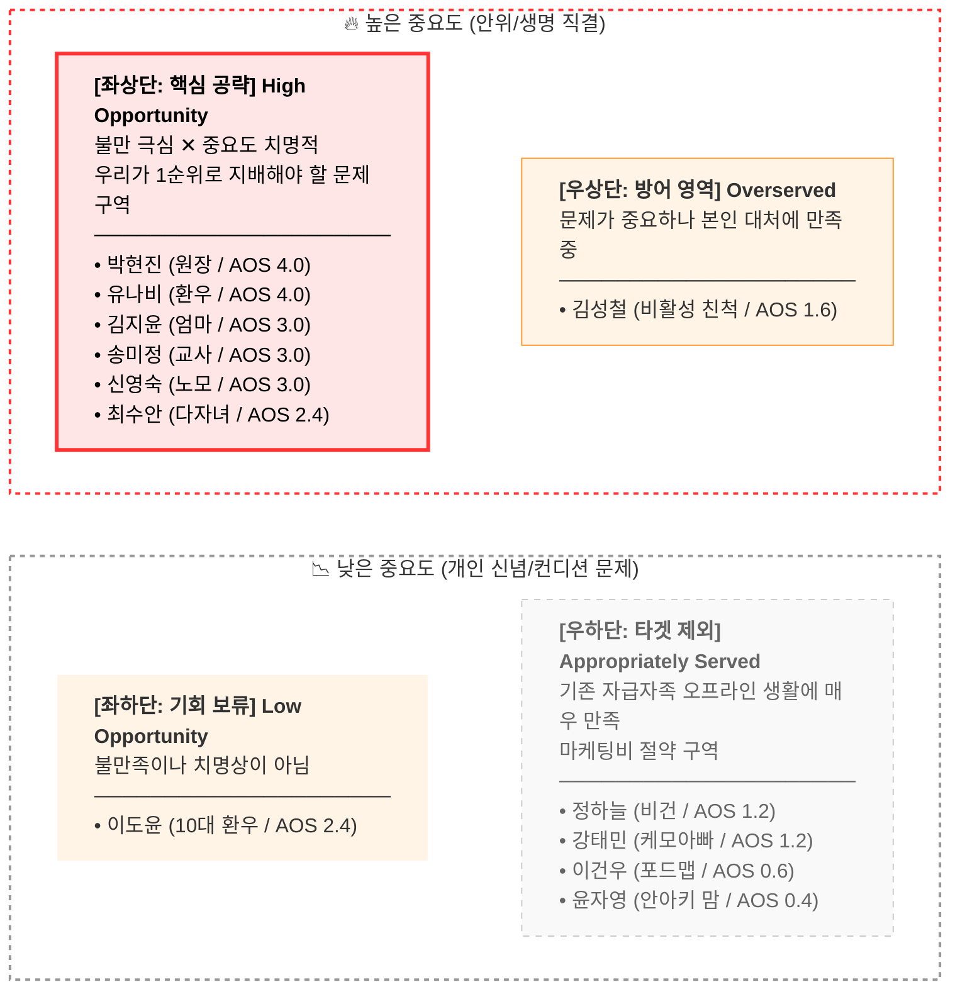
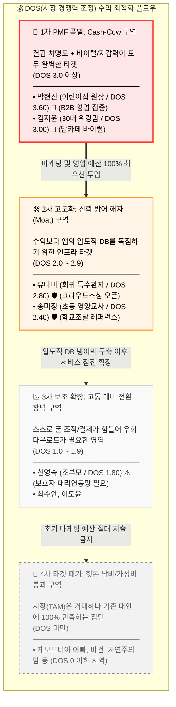

# 📈 [SafeBite] AOS & DOS 기반 비즈니스 기회 분석 보고서 (Opportunity Strategy)

**'고객이 겪는 순수 고통의 크기(AOS)'**와 **'실제 시장성 및 수익 창출 가능성(DOS)'**을 교차 분석하여 MVP 개발의 최우선 순위와 마케팅 핵심 타겟을 도출한 전략 리포트입니다.

---

## 1. 페르소나별 Pain & Goal 기초 데이터

| 페르소나 분류 | 이름(직무) | 핵심 Pain Point 요약 | 달성 목표 (Goal) | 기존 대체 솔루션 |
| :--- | :--- | :--- | :--- | :--- |
| **Core** | **김지윤**(워킹맘) | 쫓기는 시간 내 교차오염 텍스트 해독의 압박감 | 0.5초 직관적 판별 및 유치원 연동 | 맘카페 질문 대기, 아는 과자 반복 구매 |
| **Core** | **박현진**(원장) | 수기 식단표 체크의 휴먼 에러로 인한 폐원 공포 | 인력 개입 없는 시스템 방어망 구축 | 영양사의 형광펜 수기 체크 및 구두 주의 |
| **Core** | **송미정**(교사) | 공공식단과 전교생 체질 수동 대조 노동 및 징계 압박 | 나이스(NEIS) 연동 자동 에러 필터링 | 엑셀 VLOOKUP 작업, 환아 사진 타일 부착 |
| **Core** | **최수안**(다자녀맘) | 첫째, 둘째 항원이 달라 매번 이중 대조하는 피로감 | 우리 아이들 통합 프로필 동시 필터링 | 보관함 분리 및 자녀별로 식품 이중 구매/조리 |
| **Core** | **이도윤**(10대 환우) | 신상 탐색 지연으로 인한 또래 소속감/힙함 훼손 | 1초 스캔 후 쿨하게 결제하여 눈치 안 보기 | 구매 포기 혹은 화장실에서 환우 카톡방에 질문 |
| **Adjacent** | **강태민**(아빠) | 화학명 무지로 공산품 불신 (케모포비아) | 신호등 지수 기반의 결백한 무첨가 색출 | 극유기농 비싼 오프라인 전용 매장만 고집 |
| **Adjacent** | **정하늘**(비건) | 동물성 2차 오염 노출에 따른 잦은 비건 신념 훼손 | 1초 동물성 교차 오염 검수 (비건 스캐너) | 수입 비건 커머스 및 사설 화이트리스트 고집 |
| **Adjacent** | **이건우**(대학생) | 기피 성분 파악의 지루함과 배탈 사이의 타협 | 다음날 속쓰림만 막아주는 초단순 스킵 스캔 | 그냥 대충 먹고 속 아플 때 약국 항히스타민제 복용 |
| **Extreme** | **유나비**(희귀환우) | 공공 DB 밖의 희귀 미세 원료 방치로 인한 심정지 공포 | 직접 발견한 위험 성분 사설 공유 / 경고 | 식품 회사 컴플레인 센터 직접 통화 및 개인 엑셀 관리 |
| **Extreme** | **신영숙**(할머니) | 시력 저하 및 폰 UX 장벽으로 인한 정보 완전히 차단 | 앱 뎁스 없는 초대형 기호(O/X) 직관 화면 | 본인 구매 거부 및 며느리 지정 간식만 밀폐 통 배식 |
| **Non-User** | **김성철**(친척) | 유난육아 반감 및 아날로그 방임 신념 관철 실패 | 어릴 땐 골고루 다 먹어야 한다는 오기 관철 | 앱 제재 무시하고 자극적 음식 입에 무력 강제 투입 |
| **Non-User** | **윤자영**(안아키) | 가공식품 자본 생태계 불신에 의한 바코드 인프라 상실 | 완전한 무가공 천연 밥상 ও 자급자족 확립 | 100% 자급 생협 및 직접 재배 채소 활용 |

---

## 2. AOS (순수 결핍 및 고통 기회 점수) 도출

**[공식] `AOS = 중요도(I) × (1 - 만족도(S)/5)`**
- 중요도(I): 1~5점 (목표/생명 직결 치명도)
- 만족도(S): 1~5점 (기존 대안에 대한 효능감)

| 이름 (직무) | Imp(I) | Sat(S) | 최종 AOS | AOS 분석 해석 (Pain 크기) |
| :--- | :---: | :---: | :---: | :--- |
| **박현진** (원장) | 5 | 1 | **4.00** | 폐원 리스크 방어 대체재 전무 (압도적 결핍) |
| **유나비** (환자) | 5 | 1 | **4.00** | 희귀 정보 사각지대 고립 (압도적 결핍) |
| **김지윤** (워킹맘) | 5 | 2 | **3.00** | 생명 직결, 대체재 불편 및 육체적 한계 |
| **송미정** (영양교사) | 5 | 2 | **3.00** | 징계 직결, 아날로그 대조망 붕괴 가능성 |
| **신영숙** (할머니) | 5 | 2 | **3.00** | 생명 직결, 기기 장벽으로 인한 대안 부재 |
| **최수안** (다자녀맘) | 4 | 2 | **2.40** | 생명 우려 크나 노가다로 방어는 가능한 구조 |
| **이도윤** (10대) | 3 | 1 | **2.40** | 치명상(생명)은 아니나 사회적/감정적 불만 최고조 |
| **김성철** (이탈친척) | 4 | 3 | **1.60** | 본인의 만족도는 높으나 갈등 리스크 존재 |
| **강태민** (포비아) | 3 | 3 | **1.20** | 기존 비싼 유기농 마트 대안에 '만족'하여 불만 적음 |
| **정하늘** (비건) | 3 | 3 | **1.20** | 기존 수입 비건 커머스 인프라에 안주하여 불만 적음 |
| **이건우** (포드맵) | 3 | 4 | **0.60** | 문제를 포기해 버려 추가 해결책(앱)이 불필요함 |
| **윤자영** (안아키) | 2 | 4 | **0.40** | 가공품 생태계 자체를 보이콧하여 앱 도입 니즈 제로 |

### 📈 AOS 기반 4분면 매트릭스 (이상적 문제 정의 구역)

---

## 3. DOS (동적 비즈니스 기회 점수) 도출

**[공식] `DOS = AOS × Market Relevance(시장 배수)`**
- Market Relevance(0.1\~1.0): 시장 규모(TAM), 지불 의사(WTP), 바이럴 확산 속도, 채택 전환 난이도 등을 종합한 '실질 돈벌이 지수'.

| 이름(직무) | 기존 AOS | V | 시장 배수(MR) | 최종 DOS | 🔄 순위 변동 및 전략적 해석 (Insight) |
| :--- | :---: | :---: | :---: | :---: | :--- |
| **박현진** (원장) | 4.00 (1위) | × | 0.9 | **3.60 (1위)** | **[부동 1위]** 폐원 리스크 고통 + 높은 B2B 지불 능력 및 확산 파급력. |
| **김지윤** (워킹맘) | 3.00 (3위) | × | 1.0 | **3.00 (2위)** | **[상승 🚀]** 맘카페라는 극강의 앱 바이럴 확산 매개체(MR 1.0)로 최상위 티어 등극. |
| **유나비** (환자) | 4.00 (1위) | × | 0.7 | **2.80 (3위)** | **[하락 🔻]** 고통도는 최고이나 시장 TAM 한계. 단, 희귀 데이터 위키 인부로 활용하기 핵심 타겟임. |
| **송미정** (교사) | 3.00 (3위) | × | 0.8 | **2.40 (4위)** | **[유지 ➖]** 고통은 심하나 B2G 채택 난이도/느린 속도(조달망)로 인해 후순위 보완 시장. |
| **신영숙** (조부모) | 3.00 (3위) | × | 0.6 | **1.80 (5위)** | **[급락 🔻]** 노안으로 고통받지만, 앱마켓 진입 ও 설치 전환 난이도가 극악이라 수익 실효성이 반토막남. |
| **최수안** (다자녀) | 2.40 (6위) | × | 0.8 | **1.60 (6위)** | **[유지 ➖]** 시장은 작지만 가족 종속(Lock-in) 방어 무기로 최적. |
| **이도윤** (10대) | 2.40 (6위) | × | 0.7 | **1.40 (7위)** | **[유지 ➖]** 10대 무료 사용자들의 바이럴 확산성 대비 지갑력 부재 한계가 확실함. |
| **김성철** (이탈자) | 1.60 (8위) | × | 0.4 | **0.40 (8위)** | **[유지 ➖]** 앱을 설치하지 않으며 '카톡 공유 스캔뷰'만 소비하는 대상. |
| **강태민 등 (비건/무첨가)**| 1.20 | × | 0.9 | **0.00 (10위)**| **[매몰 💀]** 거대한 TAM을 지녔으나 이미 자급자족 시장에 '만족'하여 우리 솔루션 도입 니즈 0. (마케팅 투자 배제 구역) |

### 📈 DOS 구조도 (실제 GTM 및 마케팅 전략 매트릭스)

---

## 4. 최종 결론: 1차 MVP 3대 핵심 Feature (기능 단위) 정의

위 DOS 데이터 지표와 매트릭스 흐름에 따라 앱 출시 1차년도에 개발팀이 절대적으로 구현해 내야 할 3가지 핵심 기능(Solution)은 다음과 같습니다.

1. **[B2B/B2G 인프라] 보육 행정 오류 면책을 위한 API 교차망 구축**
   - **타겟:** 원장(4.0), 영양교사(3.0)
   - **구현:** 단순 바코드 스캐너를 넘어 시스템 접속 시 식단 이력과 원아 체질 시스템을 연결해 돌발 배식 오염 시 '원장/학부모/교사' 화면에 스탑 진동을 쏴주는 중앙 통신 플랫폼. (구독 매출 창출원)
2. **[디지털 소외 극복 UX] 시각/로딩을 배제한 극초직관 'O/X 햅틱 카메라'**
   - **타겟:** 워킹맘(3.0), 조부모(1.8)
   - **구현:** "숨은 우유 교차오염" 같은 텍스트 화면을 일절 제거함. 렌즈를 대자마자 0.5초 내로 스마트폰이 온통 녹색(O)이거나 빨간색 점멸(X)+진동으로 울려 문맹/노인도 아이 입에 간식이 들어가기 전 직관적으로 차단하게 설계. (트래픽 확보원)
3. **[DB 해자] 법률 사각지대 돌파형 '희귀 성분 위키(Web) 크라우드소싱'**
   - **타겟:** 희귀환자(2.8), 안아키 게릴라(0.4)
   - **구현:** 식약처 22종을 넘는 미세 오염 정보를 소비자가 직접 팩트체크하여 제조사 인증 캡처 등과 함께 앱 내 사설 게시판에 올리게 하는 권한 부여. (신뢰도 핵심 인프라원)
