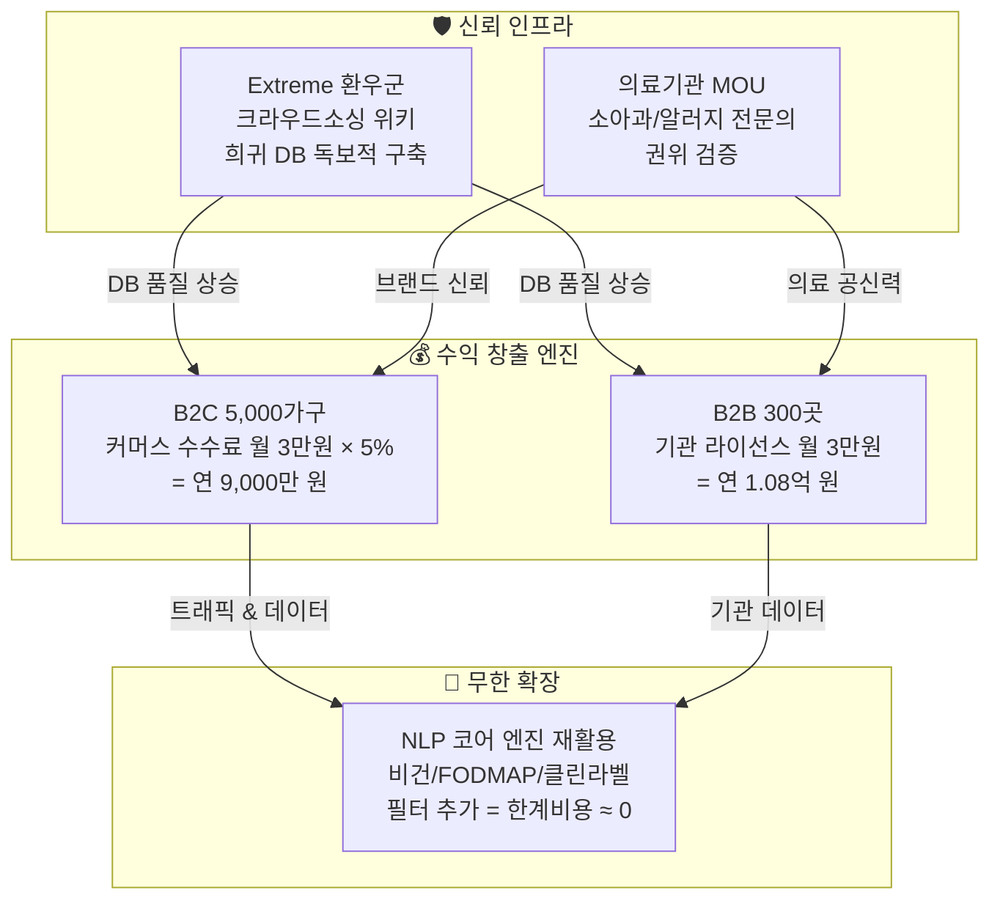

# 🛡️ SafeBite Value Proposition Sheet (통합 가치 제안서)

> **작성 목적:** 본 문서는 예비창업자가 알레르기 안심 바코드 앱(SafeBite)의 핵심 가치를 투자자, 파트너, 그리고 자기 자신에게 명확히 설명하기 위한 전략 기반 문서입니다.
> TAM-SAM-SOM, 페르소나 스펙트럼, 고객 여정 지도(CJM), AOS-DOS 기회 분석, JTBD 심층 인터뷰 결과를 교차 분석하여 도출했습니다.

---

## Executive Summary

| 항목 | 내용 |
| :--- | :--- |
| **핵심 타겟** | **① B2C:** 아나필락시스 환아를 둔 워킹맘 5,000가구 (DOS 3.0, MR 1.0 — 맘카페 바이럴 극강)<br/>**② B2B:** 배식 사고 리스크를 안고 있는 프리미엄 보육기관 300곳 (DOS 3.6 — 단독 1위)<br/>**③ Extreme:** 식약처 22종 밖 희귀 알러지 환우 (DOS 2.8 — 데이터 해자 인프라 전담) |
| **핵심 Job** | **B2C:** "아이가 응급실에 가지 않을 간식을 0.5초 만에 골라주세요"<br/>**B2B:** "교사 오배식 한 건으로 폐원되는 재앙을 시스템으로 원천 차단해 주세요"<br/>**Extreme:** "식약처가 지키지 못하는 숨겨진 성분을 내가 직접 등재하고 경고할 수 있게 해주세요" |
| **핵심 Value Proposition** | 부모에게는 **0.5초 생사 판별 렌즈**를, 보육 기관장에게는 **배식 사고 ZERO 방어 시스템**을, 희귀 환우에게는 **내가 만드는 생명 위키**를 — 하나의 NLP 코어 엔진 위에서 통합 제공하는 **'생명 방어 플랫폼'** |
| **차별화** | 기존 대안(맘카페 수동 질문, 형광펜 수기 식단표, 개인 엑셀 블랙리스트)과 달리 ①식약처 100만 건 DB + 크라우드소싱 사설 위키 결합 ②다중 프로필(다자녀) 동시 판별 ③원장-교사-학부모 3중 실시간 통신망 통합 제공 |
| **MVP 포커스** | **F1.** 0.5초 바코드/OCR 스캔 + 녹색/적색 햅틱 UI<br/>**F2.** B2B 기관 다중 원아 매칭 관리자 Web + 3중 알림<br/>**F3.** 다자녀 N명 동시 필터링<br/>**F4.** 희귀 성분 크라우드소싱 제보 위키 |
| **1년 차 SOM** | B2C 커머스 수수료 **9,000만 원** + B2B 라이선스 **1.08억 원** = **총 1.98억 원 ($150K)** |
| **AOS-DOS 핵심 인사이트** | '고통의 크기(AOS)'와 '돈이 되는 시장(DOS)'은 **반드시 일치하지 않음.** AOS 공동 1위(4.0)인 유나비가 DOS에서는 3위(2.8)로 하락하고, AOS 3위(3.0)인 김지윤이 맘카페 바이럴(MR=1.0) 덕분에 DOS 2위(3.0)로 상승. → 마케팅·개발 예산 100%를 **DOS ≥ 3.0 구역(박현진 3.6, 김지윤 3.0)**에 우선 집중해야 함. |

---

## 1. 페르소나 및 CJM 기반 핵심 문제 서술 (Pain, Needs)

### 🔴 B2C 핵심 고객군: "맹목적 보호망" (Segment A — Q2)

| 대표 페르소나 | 핵심 Pain | 감정 상태 | CJM에서 드러난 구체적 마찰 지점 |
| :--- | :--- | :--- | :--- |
| **김지윤** (34세, 고불안 워킹맘) | 퇴근 후 15분 마트 쇼핑 안에 깨알 같은 성분표를 해독해야 하는데, 교차오염 가능성 문구 하나를 놓치면 아이가 응급실에 실려간다. | 극도의 불안, 번아웃, 죄책감 | **탐색 단계:** 맘카페에 올린 질문의 답변이 30분 이상 지연 → 결국 매번 동일한 과자 3종만 반복 구매하며 아이에게 미안함을 느낀다. |
| **최수안** (39세, 다자녀 복합 알러지 주부) | 첫째는 갑각류, 둘째는 유제품 — 서로 다른 항원을 머릿속에서 이중 필터링해야 하는 인지 과부하가 매일 반복된다. | 강박, 육체적 피로, 노심초사 | **사용 단계:** 기존 앱들은 모두 단일 프로필 기준 → 자녀 간 프로필 스위칭 도중 실수 가능성이 잠복한다. |

**⚡ 종합 진단:** 이 고객군의 본질적 고통은 '정보 부족'이 아니라 **'판단의 무게'**입니다. 틀리면 아이가 죽을 수 있다는 비가역적 결과에 대한 공포가 매일의 장보기를 전쟁으로 만듭니다. 이들에게 필요한 것은 더 많은 정보가 아니라, **판단 자체를 위임할 수 있는 절대적 신뢰 시스템**입니다.

---

### 🟣 B2B 핵심 고객군: "시스템 방어자" (Segment C — Q4)

| 대표 페르소나 | 핵심 Pain | 감정 상태 | CJM에서 드러난 구체적 마찰 지점 |
| :--- | :--- | :--- | :--- |
| **박현진** (51세, 프리미엄 어린이집 원장) | 150명 원아의 체질을 수기 형광펜으로 관리하며, 교사 1명의 배식 부주의가 소송·폐원으로 직결되는 치명적 경영 리스크를 매일 안고 있다. | 두려움, 책임감의 무게 | **유지 단계:** 시스템 도입 후 "SafeBite 안심 보육원" 타이틀로 학부모를 유치하게 되면, 해지 시 학부모 이탈이 폭발하여 **자발적 종속(Lock-in)**이 형성된다. |
| **송미정** (45세, 초등학교 영양교사) | NEIS 식단표와 800명 학생의 개별 체질을 매일 엑셀 VLOOKUP으로 수동 대조 — 단 한 행의 함수 오류가 교육청 감사행으로 이어진다. | 극심한 완벽주의, 업무 과중 | **의사결정 단계:** 학교 VPN/보안 정책으로 외부 SaaS 도입이 차단됨 → 학적부 연동 없이 '바코드+체질번호'만으로 구동하는 독립 로컬 보안망이 필수 조건이다. |

**⚡ 종합 진단:** B2B 고객의 핵심 동기는 '효율 향상'이 아니라 **'재앙의 사전 차단'**입니다. 이들은 기능을 구매하는 것이 아니라 **보험을 구매**합니다. "이 시스템이 있어서 사고가 나지 않았다"는 증명이 곧 이 제품의 가치입니다.

---

### 🔵 Extreme 고객군: "사각지대 개척자" (데이터 플라이휠 엔진)

| 대표 페르소나 | 핵심 Pain | 감정 상태 | CJM에서 드러난 구체적 마찰 지점 |
| :--- | :--- | :--- | :--- |
| **유나비** (30세, 희귀 교차오염 환자) | 식약처 의무표기 22종에 포함되지 않는 희귀 원료에 반응 — 어떤 기존 앱이나 공공 DB도 자신을 보호하지 못한다. | 고립감, 분노, 사명감 | **유지 단계:** 본인이 제조사 고객센터와 싸워 캐낸 팩트 데이터를 앱에 등록 → '최초 제보자' 뱃지를 획득하며 영웅적 소속감으로 완전 락인된다. |
| **신영숙** (68세, 황혼 육아 할머니) | 노안으로 성분표 판독 자체가 물리적으로 불가능하고, 스마트폰 다단계 터치 조작에 공포를 느낀다. | 무력감, 좌절, 오조작 공포 | **사용 단계:** 화면 전체를 하나의 색상(빨강/초록)으로 채우고 강렬한 진동을 주는 초직관 UI가 아니면 사용 자체가 성립하지 않는다. |

**⚡ 종합 진단:** Extreme 사용자는 직접적 매출원이 아닙니다. 그러나 유나비 같은 환자가 발로 뛰어 구축하는 **사설 크라우드소싱 DB**는 식약처 공공 데이터를 초월하는 독보적 자산이 되며, 신영숙 같은 사용자의 존재는 **"누구도 배제하지 않는 포용적 설계"**라는 브랜드 서사를 완성합니다.

---

## 2. JTBD 관점 인터뷰 결과에 따른 고객 상황별 목표 서술 (Goal, Job)

| 타겟 | Job Statement (고객이 해결하려는 일) | Switch Trigger (전환 결정적 순간) | Switch Barrier (전환 저항) |
| :--- | :--- | :--- | :--- |
| **김지윤 (B2C)** | "아이가 먹고 응급실에 가지 않을 가장 안전한 간식을, 스트레스 없이 0.5초 만에 고르고 싶다." | 아이가 매일 같은 간식에 질려 떼를 쓰며 엄마의 죄책감을 극대화했을 때 | 앱 실행 → 로그인 → 배너 광고 등 스캔 도달까지의 조작 뎁스(Depth) |
| **박현진 (B2B)** | "오배식 소송과 폐원을 원천 차단하여, 내 사업장을 안전하게 보호하고 싶다." | 옆 지역 어린이집이 땅콩 오배식으로 맘카페에 고발당해 폐쇄 위기라는 소문을 들었을 때 | 교사용/조리사용 단말기 추가 비용 및 디지털 도구 학습 거부감 |
| **유나비 (Extreme)** | "제조사의 숨겨진 성분을 공론화하여 타 환우의 목숨을 구하고, 이기적 기업 시스템을 질타하고 싶다." | 내가 톡방에 흘린 정보로 "님 덕에 응급실 안 갔습니다"라는 피드백을 체감했을 때 | 제보 절차의 복잡함 및 개인정보 노출 우려 |

---

## 3. 고객이 원하는 Outcome (측정 가능한 형태)

JTBD 인터뷰에서 도출된 고객 기대 결과를 **중요도(Importance)**, **현재 만족도(Satisfaction)**, **AOS(고통의 크기)**, **DOS(시장 수익성)**으로 계량화한 우선순위표입니다.

| # | Outcome | Imp. | Sat. | AOS | MR | **DOS** | 인터뷰 증거 |
| :---: | :--- | :---: | :---: | :---: | :---: | :---: | :--- |
| 1 | **배식 휴먼 에러 0건** (B2B) | 5 | 1 | 4.0 | 0.9 | **3.60** | "시한폭탄이에요. 교사 실수로 감옥 가긴 싫어요." |
| 2 | **성분 확인 1분→0.5초** (B2C) | 5 | 2 | 3.0 | 1.0 | **3.00** | "바빠서 찾아볼 시간이 어딨나요? 제발 한눈에 보여주세요." |
| 3 | **희귀 원료 즉각 플랫폼 등재** (Extreme) | 5 | 1 | 4.0 | 0.7 | **2.80** | "나만 알고 있기엔 너무 치명적인 정보가 썩고 있어요." |
| 4 | **어린이집 안심망 학부모 어필** (B2B) | 4 | 2 | 2.4 | 0.9 | **2.16** | "학부모 컴플레인 없이 우리 원 경쟁력으로 쓸 수 있다면 대환영." |
| 5 | **안심 간식 선택지 3배 확대** (B2C) | 4 | 3 | 1.6 | 1.0 | **1.60** | "매일 같은 과자만 식탁에 올리니 아이에게 미안해요." |
| 6 | **타 환우 구제의 영웅적 소속감** (Extreme) | 3 | 1 | 2.4 | 0.7 | **1.68** | "내 제보로 100명이 안심했다면 그게 진짜 위로가 되죠." |

> **해석 가이드 (예비창업자 참고):**
> - **DOS가 높을수록** = 시장이 크고 고객이 돈을 낼 의향이 큰 문제입니다.
> - **AOS가 높은데 DOS가 낮으면** = 고통은 극심하지만 시장이 작습니다. (예: 희귀 환우 — 수익보다 브랜드 권위 용도)
> - **MVP에서 반드시 해결해야 할 Outcome** = DOS 상위 2개 (배식 에러 차단, 0.5초 스캔)

---

## 3-1. AOS-DOS 전략 매트릭스 (기회 분석 기반 예산 배분 전략)

**AOS(순수 고통 크기)**와 **DOS(시장성 조정 후 수익 기회)**의 교차 분석에서 도출된 4개 구역별 전략입니다.

**[공식]** `AOS = 중요도(I) × (1 − 만족도(S)/5)` → `DOS = AOS × Market Relevance(시장 배수)`

### 📈 페르소나별 AOS → DOS 변환 테이블

| 페르소나 | Imp(I) | Sat(S) | AOS | MR | **DOS** | 순위 변동 & 전략적 해석 |
| :--- | :---: | :---: | :---: | :---: | :---: | :--- |
| **박현진** (원장) | 5 | 1 | 4.00 | 0.9 | **3.60** | **[부동 1위]** 폐원 리스크 + 높은 B2B 지불 능력. 마케팅 예산 최우선. |
| **김지윤** (워킹맘) | 5 | 2 | 3.00 | 1.0 | **3.00** | **[상승 🚀]** 맘카페 극강 바이럴(MR 1.0)로 최상위 등극. |
| **유나비** (희귀환우) | 5 | 1 | 4.00 | 0.7 | **2.80** | **[하락 🔻]** 고통 최고이나 TAM 한계. DB 해자 인부로 핵심 활용. |
| **송미정** (영양교사) | 5 | 2 | 3.00 | 0.8 | **2.40** | **[유지]** B2G 조달 난이도로 후순위 보완 시장. |
| **신영숙** (할머니) | 5 | 2 | 3.00 | 0.6 | **1.80** | **[급락 🔻]** 앱 설치 전환 난이도 극악 → 수익 실효성 반토막. |
| **최수안** (다자녀맘) | 4 | 2 | 2.40 | 0.8 | **1.60** | 시장 작으나 가족 Lock-in 방어 무기로 최적. |
| **이도윤** (10대) | 3 | 1 | 2.40 | 0.7 | **1.40** | 바이럴 확산성 대비 지갑력 부재 한계. |
| **강태민 등** (Adjacent) | ~3 | ~3 | ~1.2 | 0.9 | **≈ 0** | 기존 대안에 만족 → 초기 마케팅 투입 금지 구역. |

### 💰 DOS 기반 4구역 GTM 전략

| 구역 | DOS 범위 | 대상 | 전략 |
| :--- | :--- | :--- | :--- |
| 🚨 **1차 PMF 폭발 (Cash-Cow)** | DOS ≥ 3.0 | **박현진**(3.6), **김지윤**(3.0) | 마케팅·영업 예산 100% 최우선 투입. 1년 차 SOM 전량 이 구역에서 발생. |
| 🛠️ **2차 신뢰 해자 (Moat)** | DOS 2.0~2.9 | **유나비**(2.8), **송미정**(2.4) | 수익보다 크라우드소싱 DB 구축·B2G 레퍼런스 확보에 투자. |
| 📉 **3차 보조 확장** | DOS 1.0~1.9 | **신영숙**(1.8), **최수안**(1.6), **이도윤**(1.4) | 보호자 대리 연동, 가족 종속 등 우회 채널로 점진 서비스. |
| 🛑 **4차 타겟 폐기** | DOS < 1.0 | **강태민**, **정하늘**, **이건우**, **윤자영** | 기존 대안에 만족 → 초기 마케팅 예산 **절대 투입 금지.** |

> **핵심 교훈:** MR(시장 배수) 보정이 없었다면, AOS만으로 유나비(4.0)에게 예산을 과다 배분하고 김지윤(3.0)을 과소 평가하는 치명적 자원 배분 오류가 발생했을 것입니다.

---

## 4. 우리 솔루션의 핵심 제안 (Value Proposition) 💎

### 가장 중요한 도출 결과 : 솔루션 핵심가치 제안

```
┌─────────────────────────────────────────────────────────┐
│                                                         │
│   For   부모 / 보육 기관장                                │
│   Who   자녀·원아의 알레르기 안전을 매일 확인해야 하는        │
│   Our   SafeBite는                                       │
│   That  0.5초 바코드 스캔 하나로                            │
│         "먹여도 되는가"의 판단을 즉각 대행하고,               │
│         B2B 기관에는 배식 사고 리스크를 제로(0)로             │
│         만들어주는 생명 방어 플랫폼입니다.                    │
│   Unlike  맘카페 수동 질문, 수기 형광펜 식단표                │
│   We     식약처 100만 건 DB와 크라우드소싱 실시간             │
│          데이터를 결합한 NLP 매칭 엔진으로                    │
│          오탐지율 0%, 교차오염까지 즉각 판별합니다.            │
│                                                         │
└─────────────────────────────────────────────────────────┘
```

#### 타겟별 한 줄 가치 제안

| 타겟 | 핵심 가치 제안 |
| :--- | :--- |
| **B2C (부모)** | "당신이 성분표를 읽는 1분 동안 느끼는 공포를, 우리가 0.5초의 확신으로 바꿔드립니다." |
| **B2B (원장)** | "배식 사고 한 번이면 끝나는 당신의 사업장을 3중 디지털 방어망으로 영구 보호합니다." |
| **B2B (영양교사)** | "800명분 VLOOKUP 지옥을 AI 자동 매칭으로 끝내고, 불변 로그로 면책권까지 드립니다." |
| **Extreme (환우)** | "국가 DB가 지키지 못한 당신을, 당신이 직접 만드는 위키가 지킵니다." |

---

## 5. 기존 대안 vs 우리의 차별적 가치 (Competitor / Substitute 비교)

| 비교 기준 | 기존 대안 (현재 고객의 해결책) | SafeBite의 차별적 가치 |
| :--- | :--- | :--- |
| **B2C 성분 확인** | 맘카페 질문 → 30분~수시간 대기, 라벨 사진 줌인으로 육안 판독, 안전 과자 2~3개만 반복 구매 | 바코드 스캔 **0.5초** 즉각 판별 + 교차오염 경고 + 녹색/적색 햅틱 진동으로 직관 통보 |
| **다자녀 관리** | 자녀별 간식 보관함 물리 분리, 이중 장보기, 메모장 수기 기록 | **가족 그룹 모드** — N명 자녀 프로필 동시 다중 필터, 한 번 스캔에 '첫째(O) 둘째(X)' 듀얼 결과 |
| **B2B 급식 안전** | 종이 식단표 현관 부착, 영양사 수기 형광펜 체크, 교사 구두 전달 | **3중 디지털 방어망** — 원장·교사·학부모 동시 알림 통신, 스캔 이력 불변 로그 자동 저장(면책 증거) |
| **공공 식단 매칭** | NEIS 엑셀 다운로드 → VLOOKUP 수동 대조 (오류 상존) | **NEIS API 연동 1-Click 자동 매칭** + 매일 아침 '오늘의 위험 학생' 담임 자동 발송 |
| **희귀 알러지 대응** | 제조사 고객센터 매번 전화, 개인 엑셀 블랙리스트 구축 | **크라우드소싱 제보 위키** — 원클릭 등록, 24시간 내 공식 DB 반영, 익명성 보장 |
| **시니어 접근성** | 며느리가 미리 싸준 간식 외 배식 전면 금지 (판단 자체를 포기) | **0-Depth 초직관 UI** — 로그인 없음, 화면 100% 컬러 블록(빨강/초록) + TTS 음성 안내 |
| **기성세대 통제** | 구두 설득 → 갈등 → 결렬 (통제 수단 부재) | **카카오톡 Web AR 링크** — 앱 설치 없이 0.5초 스캔 체험, 부모의 '갈등 방어 무기'로 활용 |

---

## 6. 차별적 가치의 Proof (근거 / 검증 데이터) 📊

### 📌 시장 규모 기반 근거

| 지표 | 수치 | 의미 |
| :--- | :--- | :--- |
| **TAM** | 약 58조 원 ($43.6B) | 글로벌 Free-from 식품 시장 전체 — CAGR 7.7% 초고도 성장 |
| **SAM** | 약 2,208억 원 ($166M) | 국내 0~12세 소아 알러지 35만 가구 + 전국 3만 보육기관의 유효 지불 의향 합산 |
| **SOM (1년 차)** | **약 1.98억 원 ($150K)** | B2C 5,000가구 커머스 수수료(9,000만) + B2B 300곳 라이선스(1.08억) |

### 📌 고객 인터뷰 기반 근거

| 증거 유형 | 출처 | 핵심 인용 |
| :--- | :--- | :--- |
| **B2C 지불 의향** | 김지윤 인터뷰 | "월 4,900원이 대수인가, 어린이집 선생님 폰이랑 알림 연동하면 완벽해." |
| **B2B 지불 의향** | 박현진 인터뷰 | "우리 원의 경쟁 무기가 될 수 있다면 구독료 10만 원은 저렴하죠." |
| **B2B 전환 트리거** | 박현진 인터뷰 | 옆 지역 어린이집 땅콩 오배식 폐쇄 위기 소문 → "오늘 당장 도입 연락드릴게요" |
| **Lock-in 실현** | CJM 유지 단계 | "이 시스템 해지하면 학부모들이 당장 들고 일어날 텐데, 못 무르지." |
| **데이터 플라이휠** | 유나비 인터뷰 | "전화해 보면 대기업 고객센터 직원들도 제대로 몰라요. 이 정보 혼자만 알기엔 분해요." |

### 📌 전략적 구조 근거



---

## 7. Job→MVP Feature Map (기능 우선순위 정리) 🛠️

| 기능명 | 핵심 Job 연관성 | 중요도 | 난이도 | 우선순위 | MVP |
| :--- | :--- | :---: | :---: | :---: | :---: |
| **F1. 0.5초 바코드/OCR 스캔 + 햅틱 경고 UI** | 성분 확인 1분→0.5초 (DOS 3.0) | 5 | 4 | **High** | ✔ |
| **F2. B2B 다중 원아 매칭 관리자 Web** | 배식 에러 0건 + 학부모 안심 마케팅 (DOS 3.6) | 5 | 3 | **High** | ✔ |
| **F3. 다자녀 동시 필터링 (가족 그룹 모드)** | N명 프로필 병렬 연산으로 부모 인지 부하 제거 | 4 | 2 | **High** | ✔ |
| **F4. 원장-교사-학부모 3중 실시간 알림** | 위험 식자재 감지 즉시 다자 동시 PUSH/SOS | 4 | 4 | **High** | ✔ |
| **F5. 크라우드소싱 제보 + 환우 위키** | 사각지대 희귀 원료 자체 DB 구축 (DOS 2.8) | 4 | 2 | **Mid** | ✔ |
| **F6. 안심 간식 커머스 제휴 스토어** | B2C 트래픽의 수익 전환 (SOM-1 캐시카우) | 3 | 3 | **Mid** | ✔ (M2) |
| **F7. 시니어 전용 TTS/초직관 모드** | 디지털 소외 조부모의 독립적 판단 지원 | 3 | 2 | **Mid** | ✔ (M2) |
| **F8. 카카오톡 Web AR 비설치형 스캐너** | 비활성 사용자(기성세대) 생태계 강제 편입 | 3 | 3 | **Mid** | ✔ (M2) |
| **F9. 비건/FODMAP/클린라벨 확장 필터** | Adjacent 세그먼트 유입, NLP 엔진 Scale-out | 2 | 1 | **Low** | ✖ (v2.0) |
| **F10. NEIS API 연동 학교급식 자동 매칭** | 영양교사 행정 노동 제로화, B2G 확장 거점 | 3 | 4 | **Low** | ✖ (v2.0) |

> **MVP 범위 결정 기준 (예비창업자 참고):**
> - **High** = 이것 없이는 SOM 달성이 물리적으로 불가능한 핵심 기능
> - **Mid (M2)** = 출시 후 3개월 내 추가해야 유지율(Retention)이 유지되는 기능
> - **Low (v2.0)** = 코어 시장 점유 후 TAM 확장을 위한 장기 파이프라인

---

## 8. [추가 분석] 예비창업자를 위한 전략적 시사점 및 실행 체크리스트

### 8-1. 💡 왜 B2B를 먼저 공략해야 하는가 (비직관적 전략)

직감적으로는 B2C(부모) 시장이 더 크고 접근하기 쉬워 보입니다. 그러나 JTBD 분석 결과가 알려주는 비직관적 진실이 있습니다:

| 비교 | B2C (부모) | B2B (기관) |
| :--- | :--- | :--- |
| DOS 점수 | 3.0 | **3.6** (1위) |
| ARPU (인당 매출) | 월 1,500원 (수수료) | **월 30,000원 (라이선스)** |
| 해지 저항 | 낮음 (무료 대안 존재) | **극도로 높음 (학부모 이탈 폭발)** |
| 바이럴 효과 | 개인 단위 구전 | **1개 기관 = 150가구에 동시 노출** |

**결론:** B2B 300곳을 확보하면 그 안의 45,000명 학부모가 자동으로 B2C 유입 채널이 됩니다. B2B가 B2C의 **무비용 획득 채널(Organic Funnel)**로 작동하는 구조입니다.

### 8-2. ⚠️ 핵심 가설/리스크 & 검증 계획

#### Category A: 제품 가설 — "만든 것이 작동하는가?"

| # | 가설 | 실험 설계 | 성공 기준 | 실패 시 Contingency |
| :---: | :--- | :--- | :--- | :--- |
| **H1** | **0.5초 스캔이 부모의 불안을 유의미하게 감소시킨다** | A/B 테스트: 500명을 0.3초/0.5초/1.0초 그룹 분할, 7일 재방문율·NPS 비교 | 0.5초 그룹 재방문율 1.0초 대비 **≥ 20%p↑**, NPS **≥ 40** | 임계점이 0.3초라면 로컬 캐시 확대. 속도 차이 미미하면 UI 직관성(컬러/진동)이 진짜 변수 → UI 요소별 A/B 재설계 |
| **H2** | **B2B 3중 알림이 배식 사고를 0건으로 만든다** | 파일럿 30곳 PoC: 8주간 스캔 완료율, 알림 후 교사 대응 시간, 오배식 건수 추적 | 스캔 완료율 **≥ 95%**, 대응 **≤ 30초**, 오배식 **0건** | 알림 피로 시 '위험 시에만' 축소 or 배식 전 스캔 게이트(스캔 전 배식 물리 차단) |
| **H3** | **다자녀 동시 필터링이 Lock-in을 강화한다** | 코호트 비교: 다자녀 등록 가구 vs 단일 프로필 가구의 90일 유지율 비교 | 다자녀 그룹 유지율 **≥ 15%p 높음** | 차이 미미하면 M2로 후순위, 단일 프로필 스캔 정확도에 리소스 집중 |
| **H4** | **컬러 블록+햅틱 UI가 텍스트 UI보다 오판률을 낮춘다** | 사용성 테스트: 20대~60대 50명에게 동일 제품 20개를 컬러 모드/텍스트 모드로 판독 | 컬러 모드 전 연령 정답률 **≥ 95%**, 60대 **≥ 90%** | 30~40대 '이유 확인' 니즈 → 기본 컬러 + 탭 시 텍스트 펼침 하이브리드 채택 |

#### Category B: 시장/GTM 가설 — "고객이 돈을 내고 쓰는가?"

| # | 가설 | 실험 설계 | 성공 기준 | 실패 시 Contingency |
| :---: | :--- | :--- | :--- | :--- |
| **H5** | **맘카페 바이럴이 B2C 핵심 채널이다** (MR=1.0 검증) | 멀티 채널 파일럿: 맘카페 시딩 20곳 + 인스타 광고 $500 + 소아과 전단지 10곳 동시 집행, UTM 퍼널 추적 | 맘카페 전환율 타 채널 대비 **≥ 2배** or CPA **≤ 50%** | 소아과 제휴(의사 추천)로 주 채널 전환, UGC 숏폼 광고 피벗 |
| **H6** | **B2B 원장은 '마케팅 무기' 가치로 구독료를 지불한다** | 파일럿 30곳 학부모 300명 대상 인식 조사: SafeBite 인지 여부, 입소 결정 영향, 해지 시 이동 의향 | 인지 **≥ 60%**, 입소 영향 **≥ 30%**, 이동 의향 **≥ 40%** | 인식 낮으면 인증 현판 물리 부착 + 학부모 앱 '오늘 급식 안전 리포트' 자동 발송으로 강제 인지 |
| **H7** | **Free→Family 유료 전환 트리거는 일일 스캔 3회 하드리밋이다** | A/B 테스트: 1,000명을 3회/5회/10회 제한 그룹 분할, 전환율·이탈률 비교 | 최적 그룹 전환율 **≥ 8%** | 전 그룹 5% 미만이면 하드리밋 대신 프리미엄 기능 잠금(다자녀, 교차오염 상세)으로 피벗 |
| **H8** | **크라우드소싱 위키가 자생적으로 콘텐츠를 생산한다** | Seed 전략: 환우회 3곳에서 파워 제보자 30명 사전 모집, 3개월간 제보 건수·검증 통과율 추적 | 3개월 차 월 **≥ 200건**, 통과율 **≥ 70%** | 제보 1건당 적립금 인센티브 + 내부팀이 제조사 100곳 직접 조사하여 시드 데이터 1,000건 구축 |

#### Category C: 운영/법률 리스크 — "사업을 죽일 수 있는 위험"

| # | 리스크 | 발생 시나리오 | 확률 | 영향 | 대응 전략 |
| :---: | :--- | :--- | :---: | :---: | :--- |
| **R1** | **오탐지 → 배상 소송** | 식약처 DB 지연으로 앱이 '안전' 판별 → 아이 쇼크 → 소송 | 중 | 치명 | 면책 약관 + 노란불(주의) 보수 분류 + B2B **손해배상 보험 번들링** |
| **R2** | **공공 API 중단/변경** | 식약처 API 스펙 변경 → 데이터 수주간 미갱신 → 신뢰 급락 | 중 | 높음 | 민간 DB 2~3개 다중 소스 + 주 1회 로컬 미러링 + 크라우드소싱 임시 보완 |
| **R3** | **교사·조리사 디지털 거부** | 현장 실사용률 20% 미만 → 원장 3개월 내 해지 | 높음 | 높음 | 원클릭 배식 스캔 UI(뎁스 1단계) + 현장 교육 1회 + 2차 리트레이닝 |
| **R4** | **허위 제보 → 명예훼손 고소** | 악성 유저가 경쟁사 폄훼 목적 허위 제보 → 제조사가 고소 | 중 | 치명 | 제조사 답변 캡처 인증 필수 + 검증 전 '미검증' 태그 + 익명성 보장 + D&O보험 |
| **R5** | **개인정보 보호법 위반** | 원아 건강 정보 동의 절차 미비 → 과태료 + 서비스 중단 | 높음 | 치명 | 로컬 암호화 저장(서버에 해시만) + 건강 정보 동의서 필수 + PIA 자발 수행 |
| **R6** | **대형 플랫폼 유사 기능 출시** | 네이버/카카오가 바코드+알러지 필터 자체 출시 → B2C 잠식 | 중 | 높음 | B2B 통신망·크라우드소싱 DB·다자녀 필터 = 복제 불가 해자. 최악 시 B2B+커머스 양축 피벗 |
| **R7** | **SOM 과대 추정** | 실제 전환율이 기대치의 1/3 → Worst Case SOM 약 5,040만 원 | 높음 | 높음 | Worst Case 기준 18개월 런웨이 확보(최소 1.5억 시드). 대안 수익원(제조사 API 제휴비) 탐색 |
| **R8** | **식약처 DB 구조적 한계** | 22종 밖 교차오염은 표시 의무 없어 DB 자체가 부재 | 확실 | 높음 | '교차오염 가능성' 제품은 무조건 노란불 + 크라우드소싱 보완 + 장기적 정책 제안서 제출 |

### 8-3. 🚀 1년 차 마일스톤 로드맵

```
Month 1-3: MVP 개발 (F1, F2, F3, F4)
  └─ 핵심 기능 완성 + 식약처 공공데이터 API 연동
  
Month 4-5: 파일럿 런칭
  └─ B2B 프리미엄 어린이집 30곳 무상 시범 도입 (PoC)
  └─ B2C 맘카페 바이럴 시딩 시작

Month 6-8: 정식 런칭 + 유료 전환
  └─ B2B 파일럿 → 유료 라이선스 전환 (목표: 100곳)
  └─ B2C 5,000가구 활성 사용자 확보
  └─ F5(크라우드소싱), F6(커머스 제휴) 배포

Month 9-12: 스케일 업
  └─ B2B 300곳 달성 → 연매출 1.08억 달성
  └─ B2C 커머스 제휴 수익화 본격화 → 연매출 9,000만 달성
  └─ 소아과 MOU 체결으로 의료 권위 기반 확보
  └─ SOM 1년 차 총 목표: 1.98억 원 ($150K)
```

### 8-4. 📐 핵심 KPI 대시보드 (투자 피칭용)

| KPI | 1년 차 목표 | 측정 방법 |
| :--- | :--- | :--- |
| B2C MAU (월간 활성 사용자) | 5,000가구 | 앱 로그인 + 스캔 1회 이상/월 |
| B2B 계약 기관 수 | 300곳 | 유료 라이선스 결제 기관 수 |
| 일평균 스캔 횟수 | 15,000회 | 바코드/OCR 스캔 이벤트 로그 |
| B2C 커머스 전환율 | 12% | 스캔 → 제휴 구매 클릭 비율 |
| B2B 월간 해지율 (Churn) | < 3% | 라이선스 해지 기관 / 전체 기관 |
| 크라우드소싱 제보 건수 | 월 500건 | 신규 성분 제보 등록 수 |
| **연간 총 매출** | **1.98억 원** | B2C 9,000만 + B2B 1.08억 |

---

> **📋 문서 메타 정보**
> - **분석 기반 데이터:** TAM-SAM-SOM(6), 페르소나 스펙트럼(7), 통합 CJM(8), **AOS-DOS 전략 분석(9)**, JTBD 인터뷰(10)
> - **작성 프레임워크:** VPS 작성방법 가이드 기반 + AOS-DOS 4구역 전략 매트릭스 + 예비창업자 가설/리스크 검증 체크리스트 추가
> - **최종 업데이트:** 2026-04-21
