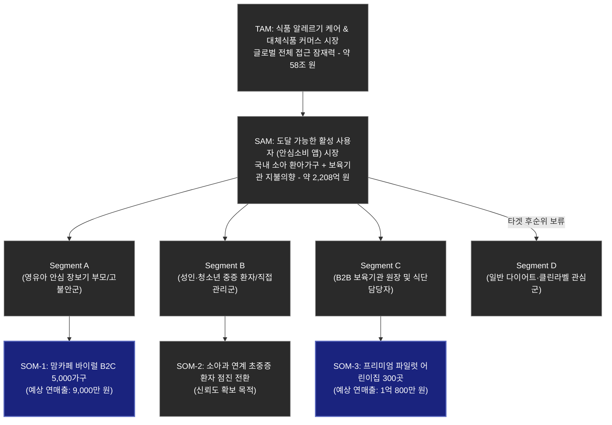
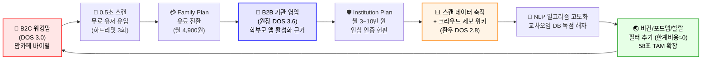

# 🛡️ SafeBite Value Proposition Sheet (통합 가치 제안서) — Merged V2

> **엘리베이터 피치:**
> "B2C 학부모에게는 정보 해독이 아닌 **판단 자체를 0.5초 만에 대행**해 주는 '생명 투명 렌즈'를, B2B 기관장에게는 **소송과 폐원을 물리적으로 차단**하는 불변의 '디지털 행정 방어벽'을 — 하나의 NLP 코어 엔진 위에서 통합 제공하는 **생명 방어 플랫폼**입니다."
>
> **포지셔닝:** 기존 대안(맘카페 수동 질문, 형광펜 수기 식단표, 개인 엑셀 블랙리스트)과 달리, ①식약처 100만 건 DB + 크라우드소싱 사설 위키 결합 ②다중 프로필(다자녀) 동시 판별 ③원장-교사-학부모 3중 실시간 통신망을 통합 제공합니다. **초기 마케팅 예산은 DOS ≥ 3.0 구역(박현진 3.6, 김지윤 3.0)에 100% 집중 투입하며, DOS < 1.0 구역(Adjacent 세그먼트)에는 절대 투입 금지합니다.**

---

## 📑 목차

| # | 섹션 | 내용 |
| :---: | :--- | :--- |
| 0 | [Executive Summary](#📌-executive-summary-요약) | 핵심 타겟, Job, VP, MVP 포커스 요약 |
| Ⅰ | [비즈니스 환경 분석 및 핵심 문제 정의](#ⅰ-비즈니스-환경-분석-및-핵심-문제-정의) | 3대 문제 정의 / Porter 5F / 경쟁사 Top5 / 가치사슬 / KSF / TAM-SAM-SOM+Mermaid / 소비자 행동 지표 / 가설 검증 매트릭스 / 페르소나 6인 / CJM Pain 교차 / 성장 플라이휠 |
| Ⅱ | [페르소나 스펙트럼](#ⅱ-페르소나-스펙트럼) | 12명 전수 프로필 + 세그먼트별 모수 규모 |
| Ⅲ | [AOS–DOS Combined Matrix](#ⅲ-aosdos-combined-matrix) | 12명 Imp×Sat 원본 + DOS 서술형 전략 해석 + 4구역 GTM |
| Ⅳ | [JTBD 요약 카드](#ⅳ-jtbd-요약-카드) | 김지윤·박현진·유나비 심층 인터뷰 + 인용구 + Outcome 표 |
| Ⅴ | [Value Proposition Sheet](#ⅴ-value-proposition-sheet) | 핵심 가치 제안 선언문 + VP Proof 테이블 + 기존 대안 비교 |
| Ⅵ | [TAM-SAM-SOM 및 수익 구조](#ⅵ-tam-sam-som-시장-규모-및-수익-구조) | 시장 규모 산정 + 세그먼트별 CPA + 4-Tier 수익 모델 |
| Ⅶ | [경쟁사 벤치마킹 KSF 전략](#ⅶ-경쟁사-벤치마킹-기반-ksf-전략) | 글로벌 5개사 가치사슬 기반 5대 KSF 실행 과제 |
| Ⅷ | [Job(Value)–MVP Feature Map](#ⅷ-jobvaluemvp-feature-map) | 7개 기능 × 6컬럼 + 리스크 사전·사후 대응 2단계 |
| Ⅸ | [핵심 리스크 & Contingency Plan](#ⅸ-핵심-리스크-가설-및-contingency-plan) | 4대 시장 가설 + 7대 운영·법률·기술 리스크 대응 |
| Ⅹ | [MVP 구현 상세 & Next Steps](#ⅹ-mvp-구현-상세-계획--next-steps) | 12개월 타임라인 + 개발·마케팅·법무 팀별 체크리스트 |

---

## 📌 Executive Summary (요약)

- **핵심 타겟:**
  - **1차 (B2C):** 장보기 시간 부족과 교차오염 공포에 시달리는 **30대 워킹맘(김지윤)** & 복합 항원 관리로 인지 부하 한계에 달한 **다자녀 부모(최수안)**
  - **1차 (B2B):** 단 한 건의 배식 사고로 인한 소송 및 폐원 리스크를 100% 방어해야 하는 **프리미엄 어린이집 원장(박현진)**
  - **데이터 인프라 (Extreme):** 법적 사각지대에 놓여 제조사와 싸우는 **희귀 환우(유나비)**
- **핵심 Job:**
  - "이 간식을 아이에게 먹여도 되는지 고민 없이 단 0.5초 만에 안전 여부를 알고 싶다." (B2C)
  - "학부모의 컴플레인과 오배식 책임을 시스템적으로 원천 차단해 사업장을 방어하고 싶다." (B2B)
- **핵심 Value Proposition:**
  "B2C 학부모에게는 **정보 해독이 아닌 판단 자체를 대행해 주는 '0.5초 투명 렌즈'**를, B2B 기관장에게는 **소송과 파산을 물리적으로 막아주는 불변의 '디지털 행정 방어벽'**을 하나의 엔진으로 제공합니다."
- **MVP 포커스:**
  1) 0.5초 판별 스캐너(바코드/OCR) + 시각/햅틱 알람
  2) B2B 다중 원아 식단 매칭 관리자 대시보드 + 3중 원격 알림망
  3) 계정 스위칭 없는 다자녀(가족) 한 번에 필터 연산
  4) 희귀 성분 검증용 크라우드소싱 제보 위키


## Ⅰ. 비즈니스 환경 분석 및 핵심 문제 정의

> 출처: `01_Poter's Five Force_Analysis.md`, `02_Competitor_Business_Briefing.md`, `03_Integrated_Value_Chain_Analysis.md`, `04_Master_Integrated_KSF_Strategy.md`, `05_Core_Problem_Statements.md`, `06_TAM-SAM-SOM.md`, `08_Integrated_Customer_Journey_Map.md`

### 1-1. 3대 핵심 문제 정의

#### 관점 1. 영유아 부모 중심 (생명 안심 및 응급 헬스케어)
[중증 알러지나 아나필락시스 폭발 위험을 안고 있는 영유아의 **부모**]가 [아이를 어린이집, 유치원 등 보호자의 직접적인 통제망 밖으로 하루 종일 보내야만 하는 **상황**]에서 겪는 [시중 가공식품의 숨겨진 교차오염 여부를 직접 확인하지 못해 느끼는 극도의 불안감과, 만에 하나 쇼크 발생 시 골든타임 내에 119 통보 및 에피펜 투여가 이루어지지 못할 것이라는 **생명 직결의 두려움**]을 해결하는 것이 중요한 문제이다.

#### 관점 2. 10대 청소년 및 밀레니얼 부모 (스캔 편의 및 직관적 클린 라벨)
[알레르기 질환이 있거나 유해 첨가물 섭취를 피하고자 하는 **10대 청소년 및 밀레니얼 부모**]가 [편의점이나 대형 마트에서 매일 쏟아지는 자극적인 가공식품 무리 중 자신이 먹을 간식을 직접 고르는 **오프라인 상황**]에서 겪는 [제품 뒷면에 적힌 깨알 같고 어려운 원재료 텍스트를 일일이 해독해야 하는 **인지적 피로감**과, '나에게 안전한 음식'을 직관적으로 선별해 내지 못해 안심하고 소비 활동을 즐기기 어려운 **불편함**]을 해결하는 것이 중요한 문제이다.

#### 관점 3. 교육기관 담당자 (B2B 데이터 인프라)
[다수의 각기 다른 알러지 유병 학생을 동시에 안전하게 책임져야 하는 **학급 담임교사 및 영양교사**]가 [매일 배식되는 나이스(NEIS) 단체 급식 현장이나 외부 현장 체험학습 **상황**]에서 겪는 [수십 명의 복합 알러지 정보를 수기로 대조해야 하는 극심한 **행정적 스트레스**와, 만일 응급 사태 시 특정 아이의 응급 매뉴얼 확인 및 119·학부모 전파가 일원화되지 않아 발생하는 관리 사각지대의 **치명적 법적/도의적 리스크**]를 해결하는 것이 중요한 문제이다.

---

### 1-2. Porter's 5 Forces 다중 시장 분석

우리 앱이 발을 들이는 2가지 중추 시장 — **"시장 A의 가벼움으로 고객을 넓게 모아, 시장 B의 묵직함으로 완벽히 락인시킨다"**

| 5 Forces | 시장 A: 일상적 성분 분석 스캐너 | 시장 B: 유아 알러지 응급 헬스케어 | 전략적 차이점 |
| :--- | :--- | :--- | :--- |
| **① 신규 진입자 위협** | **강함** — DB만 있으면 앱 자체는 쉽게 제작 가능 | **약함** — 실수 시 인명사고 직결. 의료 자문/신뢰 장벽 극강 | A는 IT 장벽, B는 의료/공신력 장벽. **B를 해자(Moat)로 삼아 A의 진입자를 따돌림** |
| **② 기존 경쟁자 경쟁** | **강함** — Yuka, 화해, 다이어트 앱 등 무한 경쟁 | **약함** — 아나필락시스 119/학교 연동 강자가 **국내 전무** | 넓은 웰니스 경쟁 vs 생명 구호 인프라 선점의 완전한 블루오션 |
| **③ 구매자의 교섭력** | **매우 강함** — 비싸면 바로 앱 삭제 | **바닥 수준** — "내 아이의 생명이 걸렸으므로 뭐든 수용" | A에서 모은 무료 유저를 B의 논리로 전환 시 **저항이 무너짐** |
| **④ 공급자의 교섭력** | **중간** — 오픈 마켓/크롤링 확보 용이 | **강함** — 식약처 공공 API, 소아과/응급실 데이터 의존도 높음 | **데이터 품질이 핵심.** 의료계 전문의 협력이 절대적 |
| **⑤ 대체재의 위협** | **강함** — 눈으로 라벨 읽기, 맘카페 검색 | **매우 약함** — 아이가 쓰러졌을 때 SOS 이외 대안 없음 | 평시 대체 가능하나, **사고 공포 때문에 결국 실시간 안전망을 대체 불가** |

#### 5-Forces 정량 스코어 요약

| Force | 위협 수준 | 스코어 | 핵심 근거 |
| :--- | :--- | :---: | :--- |
| ① 신규 진입자 | ⏬ 낮음 | **2/5** | 의료 공신력 + 유저 프로필 락인으로 후발 방어 |
| ② 기존 경쟁자 | ⏬ 최소 | **1/5** | 국내 아나필락시스 안전 앱 직접 경쟁자 **전무** |
| ③ 구매자 교섭력 | ⏬ 바닥 | **1/5** | 생명 직결 → 월 3,900원 구독 이탈(Churn) 사실상 無 |
| ④ 공급자 교섭력 | ⏫ 높음 | **4/5** | 식약처 API 중단 시 앱 전체 마비. **극복 1순위 과제** |
| ⑤ 대체재 위협 | ⏬ 낮음 | **2/5** | 0.5초 스캔 속도를 이길 오프라인 대체재 부재 |

> **결론:** 데이터 공급의 초기 구축 난이도만 무너뜨리면, 후발 주자 진입 불가 + 유저 결제 보장인 **'진입 허들은 높고 수익은 확실한 A급 성곽' 모델**.

---

### 1-3. 경쟁사 3개 도메인 Top 5 비즈니스 브리핑

| 기업명 (국적) | 비즈니스 규모 | 핵심 비즈니스 모델 | 전략 특징 | 도메인 |
| :--- | :--- | :--- | :--- | :--- |
| **Yuka** (프랑스) | 7,300만 명+, 연 $20M+ | Freemium (연 15유로). 철저한 무광고 원칙 | 바코드 1초 만에 100점 만점 신호등 결과. 브랜드 스폰서십 100% 차단 | 일상 스캐너 |
| **Fig** (미국) | 수백만 DL, VC 투자 유치 | Freemium (Fig+ 구독) | **초개인화 Food Fingerprint** — 가족별 복잡한 알러지+특수식단(FODMAP 등) 세밀 설정 | 알러지 특화 |
| **Allergy Force** (미국) | Niche 고충성도, '2023 최혁신 앱' 수상 | Freemium (구독) | **타임-크리티컬 응급 인프라** — 119 다이얼+에피펜 가이드+보호자 자동 위치 알림 | 응급 헬스케어 |
| **Trash Panda** (미국) | 100% 부트스트랩 흑자 전환 중 | Freemium (月 5회 Hard Limit) | **클린 라벨 투명성** — 타르색소/발암 의심물질 직관 경고. TikTok 숏폼 바이럴 | 클린 라벨 |
| **Edamam** (미국) | $1.9M 투자, 네슬레·NYT·삼성 고객 | B2B API 라이선싱 (DaaS 종량제) | **백엔드 식품 데이터 파이프라인 장악** — 90만 건+ DB를 타 플랫폼에 API 공급 | B2B 인프라 |

---

### 1-4. 가치사슬(Value Chain) 주요/지원 활동 설계

#### 주요 활동(Primary) — 5개사 교차 비교

| 활동 | Yuka | Allergy Force | Fig | Edamam | Trash Panda |
| :--- | :--- | :--- | :--- | :--- | :--- |
| **핵심 데이터** | 바코드-성분 크라우드소싱 DB | 메디컬 프로필+응급 프로토콜 | 초개인화 식단 룰셋 | 식품 온톨로지+NLP | 독성물질 블랙리스트 |
| **파이프라인** | 0.5초 웰니스 스코어링 | 원터치 SOS 응급망 발동 | Food Fingerprint 매칭 | 텍스트→JSON 영양/알러지 변환 | 유해성분 대조 필터링 |
| **CAC 전략** | SNS 충격 바이럴 (CAC≈0) | 소아과 권위 하향식 | 질환 커뮤니티 바이럴 | 개발자 인바운드 세일즈 | TikTok/Reels 숏폼 어그로 |
| **과금 훅** | 알러지 맞춤 필터 (연 15유로) | 생존 공포(Fear) SOS | 가족 다중 프로필 Paywall | API Call 종량제 Tier | 月 5회 Hard Limit→충동 결제 |
| **Lock-in** | 시민운동 소속감 | 아나필락시스 공포 통제권 | 가족 프로필 누적 전환비용 | API 코드 이식 후 이탈 불가 | 클린 컬쳐 소속감 |

#### 지원 활동(Support) — SafeBite 설계 원칙

```
[인프라]     소아과 학회 자문위원 + 식약처 법무 자문 초기 필수 투자
[HR]         Data Architect + 임상영양사 + 그로스 마케터 (3대 코어 포지션)
[기술]       Flutter 크로스플랫폼 + AWS Serverless + Twilio API Mash-up MVP
[조달]       Edamam API + 식약처 공공데이터 활용 → 규모화 이후 자체 DB로 독립
```

#### SafeBite 주요 활동 설계

```
[내부 물류]  식약처 공공데이터 + Edamam API → 유아 알러지 전용 교차오염 DB로 고도화
[운영]       바코드 스캔 → 교차오염 검출(0.5초) + SOS 발동 시 119+담임+부모 동시 알림
[유통]       홈 위젯(Zero-Depth) + 모바일 앱 메인 채널 + (미래) B2B API
[마케팅]     맘카페 커뮤니티 바이럴 + 소아과 권위 기반 하향식 + 숏폼 충격 콘텐츠 병행
[서비스]     급식 식단표 선행 분석 푸시 + 가족 프로필 스위칭 비용 누적
```

---

### 1-5. KSF(핵심 성공 요인) Top 5

| # | KSF | 결합 공식 | SafeBite 실행 과제 |
| :---: | :--- | :--- | :--- |
| 1 | **독점 알고리즘 + 데이터 플라이휠** | Edamam(온톨로지)+Yuka(크라우드소싱)+AF(의료 방어) | NLP 룰 엔진 선제 구축. 미발견 바코드 100P 리워드. 판별 근거에 전문의 마크 의무화. |
| 2 | **가족 초개인화 + SOS 통신 = 이탈 제로** | Fig(다중 프로필)+AF(SOS)+Yuka(0.5초 스캔) | Zero-Depth UX. 형제 프로필 원터치 스위칭. 긴급 119+보호자 SMS 동시 푸시. |
| 3 | **공포(Fear) + 하드리밋 다층 페이월** | TP(하드리밋)+AF(생명 유료화)+Yuka 약점 회피(커머스) | 일일 3회 무료 스캔→마트 현장 충동 결제. 'Safe Kids Choice' 커머스 제휴. |
| 4 | **의료 권위(Top) + 숏폼(Bottom) = Zero-CAC** | AF(소아과 추천)+TP(숏폼)+Fig(환우 커뮤니티) | 소아과 QR 스탠드. 릴스 유해성분 숏폼. 앰버서더 20명 위촉. |
| 5 | **린 API 조립 + MSA 설계** | TP(BaaS)+AF(통신 API)+Edamam(API 생태계) | Firebase+알림톡으로 서버 인건비 제로. MSA 분리→B2B DaaS 아키텍처. |

---

### 1-6. TAM-SAM-SOM 수치 + 마켓 세그먼트

| 구분 | 규모 | 산정 근거 |
| :--- | :--- | :--- |
| **TAM** | **약 58조 원 / $43.6B** | 글로벌 Free-from 식품 시장 전체 (CAGR 7.7%). FARE·Statista 지표 |
| **SAM** | **약 2,208억 원 / $166M** | 국내 0~12세 소아 알러지 35만 가구(연 60만 원 지출 의향) + 전국 3만 보육기관 |
| **SOM (1년 차)** | **약 1.98억 원 / $150K** | B2C 5,000가구 커머스 수수료 + B2B 프리미엄 300곳 라이선스 |



#### 4분면 세그먼트 매트릭스

| Y축: 치명도 | 내재적/자발적 (스스로 필요) | 외재적/과제적 (책임 완수를 위해 필요) |
| :--- | :--- | :--- |
| **높음 (생명 직결)** | **Q1: 능동적 생존자** (Segment B)<br>규모: ~1,000명 (SOM-2)<br>전략: 의료 특화 / 권위 타겟 | **Q2: 맹목적 보호망** (Segment A)<br>규모: 5,000가구 (SOM-1, **연 9천만 원**)<br>전략: **핵심 과금 / 볼륨 타겟** |
| **낮음 (행정/가치)** | **Q3: 가치 지향 소비군** (Segment D)<br>규모: N/A (1차 타겟 제외)<br>전략: 오거닉 인식 개선만 | **Q4: 시스템 방어자** (Segment C)<br>규모: 300곳 (SOM-3, **연 1.08억 원**)<br>전략: **B2B 통신망 락인 타겟** |

> **핵심 시사점:**
> 1. 지갑을 여는 핵심 동력은 철저히 **Q2+Q4(외재적 과제 수행자)**에 집중. 통제 불가한 아이/원아를 대신 보호해야 하는 보호자·원장의 WTP가 압도적.
> 2. 알고리즘의 무결성은 상단(Q1, Q2)에서 확보 → 하단(Q4, Q3)으로 파이 확장.
> 3. **초기 Q3(클린라벨) 기능 개발은 과감히 배제.** 오직 Q2 '0.5초 스캔'과 Q4 '다중 원아 매칭' 코어 엔진에만 투자.

---

### 1-7. 소비자 행동 핵심 지표 (공개 조사 데이터 기반)

| 지표 | 수치 | 출처 | 전략적 의미 |
| :--- | :--- | :--- | :--- |
| 소아 알레르기 유병률 | **7~8% (10년 새 400% 폭증)** | 건강보험심사평가원 | 수요 기반 지속 성장 확인 |
| 국내 0~12세 인구 | 약 470만 명 | 통계청 | SAM 산정 모수 |
| 보육기관 수 | 약 **3만 곳** | 육아정책연구소(KICCE) | B2B SOM-3 산정 근거 |
| 맘카페 바이럴 전환율 기대치 | **타 채널 대비 2배+** | 맘톡·맘스홀릭 내부 추정 | MR=1.0의 실증 기반 |
| 글로벌 Free-from 시장 CAGR | **7.7%** | Statista / FARE | TAM 성장 확인 |
| 에잇포켓 현상 (아이 안전 지출 심리적 저항) | **매우 약함** | 한국사회학회 소비 분석 | B2C 과금 저항 최소화 근거 |
| Yuka 글로벌 유저 | **7,300만 명** | Yuka 공식 발표 | 시장 검증 — 스캐너 앱 대중화 실증 |

---

### 1-8. 가설 검증 강도 매트릭스

| 가설 ID | 가설 내용 | 검증 방법 | 검증 시점 | 성공 기준 | 실패 시 대안 |
| :---: | :--- | :--- | :--- | :--- | :--- |
| H1 | 0.5초 스캔이 구매 결정에 충분하다 | 얼리액세스 500명 A/B 테스트 (0.5초 vs 2초) | Phase 1 | 스캔→구매 전환율 ≥60% | 하이브리드 UI(컬러+텍스트) 즉각 분리 |
| H2 | 다자녀 동시 필터가 Lock-in을 만든다 | 코호트 분석 (다자녀 vs 단자녀 90일 유지율) | Phase 3 | 다자녀 유지율 ≥15%p 상회 | Lock-in 방어 기능을 M2로 후순위 조정 |
| H3 | B2B 기관은 PoC 후 유료 전환한다 | 30곳 파일럿 8주 관찰 | Phase 2 | 유료 전환율 ≥30% (9곳+) | 현판+스티커 무상 확대 → 마케팅 무기 강화 |
| H4 | 컬러 스캔이 텍스트보다 오류를 줄인다 | 100명 사용성 테스트 (오판률 측정) | Phase 1 | 오판률 ≤1% | 컬러+텍스트 하이브리드 병용 |
| H5 | 맘카페가 최고 효율 채널이다 (MR=1.0 검증) | 멀티채널 파일럿 (맘카페 vs 소아과 vs 숏폼) | Phase 2 | CPA ≤50% or 전환율 ≥2배 | 소아과 추천 의사로 주 채널 전환 |
| H6 | B2B 도입 시 학부모 인지→입소 영향 | 300명 학부모 조사 | Phase 2 | 도입 인지 ≥60%, 입소 영향 ≥30% | 학부모 앱 '오늘 급식 안전 리포트' 자동 발송 |
| H7 | 하드리밋 3회가 유료 전환 최적점 | 1,000명 A/B (3회/5회/10회) | Phase 3 | 최적 그룹 전환율 ≥8% | 기능 잠금형(다자녀 필터 프리미엄) 피벗 |
| H8 | 크라우드소싱 위키가 자생적으로 작동 | 환우회 30명 시드 모집 | Phase 2 | 3개월 차 월 ≥200건, 검증 통과 ≥70% | 적립금 인센티브 + 내부 100곳 직접 조사 |

---

### 1-9. 페르소나 핵심 6인 상세 프로필

#### 🎯 김지윤 (34세, 고불안 워킹맘 — Core Q2)
| 항목 | 내용 |
| :--- | :--- |
| **Problem** | 퇴근 후 짧은 마트 쇼핑 시간에 아이 간식을 골라야 하는데, 깨알 같은 텍스트와 숨겨진 교차오염 우려를 직접 확인하기가 막막합니다. |
| **Goal** | 0.5초 스캔 만에 안심 간식을 100% 판별하고, 어린이집에 돌발 쇼크 대처 SOS 매뉴얼을 앱 연동으로 즉각 공유 |
| **Emotion** | 극도의 불안, 압박감, 번아웃 |
| **현재 대안** | 맘카페 검색 + 이미 성분을 외운 안전 과자 2~3개만 반복 구매 |

#### 🎯 박현진 (51세, 프리미엄 어린이집 원장 — Core Q4)
| 항목 | 내용 |
| :--- | :--- |
| **Problem** | 수기 급식 기록만으로는 교사 배식 실수를 100% 막을 수 없어, 돌발 사고 시 소송이나 폐원으로 직결될 수 있는 치명적 경영 리스크. |
| **Goal** | B2B 다중 스캔 통신망으로 행정 오류 차단 + 학부모에게 '안심 보육 환경'이라는 마케팅 신뢰 제공 |
| **Emotion** | 막연한 두려움, 책임감, 행정적 부담 |
| **현재 대안** | 영양사의 형광펜 수기 체크 + 아침마다 담임교사에게 구두 주의 전달 |

#### 🎯 유나비 (30세, 희귀 교차오염 환자 — Extreme Q1)
| 항목 | 내용 |
| :--- | :--- |
| **Problem** | 식약처 22종 밖의 희귀 미세 원료 교차오염에 반응해 어떤 시중 데이터나 기존 앱으로도 보호받지 못합니다. |
| **Goal** | 앱 내 제보 기능(크라우드소싱)으로 본인이 발굴한 블랙리스트 등록, 동일 환우회와 데이터 사설 공유 |
| **Emotion** | 고립감, 사각지대 분노, 사명감 |
| **현재 대안** | 제조사 고객센터 전화 + 본인만의 수기 엑셀 블랙리스트 시트 |

#### 🎯 최수안 (39세, 다자녀 복합 알러지 — Core Q2)
| 항목 | 내용 |
| :--- | :--- |
| **Problem** | 첫째 갑각류/둘째 유제품 — 서로 항원이 달라 매일 이중 대조해야 하는 피로감. |
| **Goal** | 앱 스위칭 없이 두 아이 프로필을 동시 매칭해 '일괄 안전 식품'인지 한 번에 확인 |
| **Emotion** | 강박, 육체적 피로, 노심초사 |
| **현재 대안** | 자녀별 간식 보관함을 물리적으로 엄격히 분리 + 이중 구매/조리 |

#### 🎯 신영숙 (68세, 황혼 육아 할머니 — Extreme Q2)
| 항목 | 내용 |
| :--- | :--- |
| **Problem** | 심한 노안으로 깨알 같은 경고 문구를 전혀 읽을 수 없으며, 스마트폰 조작 자체가 공포. |
| **Goal** | 회원가입 없이 화면 전체 극단적 기호(O/X)나 치명적 진동으로 '이걸 먹여도 되는지' 즉각 통보 |
| **Emotion** | 무력감, 좌절, 폰 오조작 공포 |
| **현재 대안** | 며느리가 지정 간식 통에 담아준 것 이외에는 배식 일절 금지 |

#### 🎯 송미정 (45세, 초등학교 영양교사 — Core Q4)
| 항목 | 내용 |
| :--- | :--- |
| **Problem** | NEIS 식단표와 800명 전교생 개별 체질을 매일 수동 VLOOKUP 대조. 1g의 교차오염도 허용 불가한 압박. |
| **Goal** | NEIS 식단과 학생 체질을 자동 알고리즘 매칭, 위험 요소만 담임 모바일 뷰로 매일 발송 |
| **Emotion** | 극심한 완벽주의, 업무 과중, 강박 |
| **현재 대안** | 공공 엑셀 VLOOKUP 수동 처리 + 급식 배식구 타일에 환아 사진 테이핑 부착 |

---

### 1-10. CJM 단계별 Pain 교차 분석 (6인 핵심 마찰 지점)

| CJM 단계 | 김지윤 (B2C) | 박현진 (B2B) | 유나비 (EXT) | 최수안 (다자녀) | 신영숙 (시니어) | 송미정 (B2G) |
| :--- | :--- | :--- | :--- | :--- | :--- | :--- |
| **문제 인식** | 교차오염 텍스트 가독성 최악 | 100% 수기 의존 → 시한폭탄 | 법적 의무표시 22종 밖 성분 방치 | N명 이중 필터링 인지 과부하 | 노안으로 경고 문구 해독 불가 | 800명 체질 수동 대조 강박 |
| **탐색** | 맘카페 응답 속도 느림 | 키즈노트 등 셋업 장벽 | 엑셀로 썩는 정보의 갑답함 | 다중 계정 미지원 앱의 한계 | 카톡으로 며느리에게 일일이 물어봄 | 커스텀 매크로 오류 여전 |
| **의사결정** | 생명 직결 치명적 오류 불신 | B2B 구독료 예산 부담 | 폐쇄형이면 즉시 삭제 | 다중 프로필 입력 번거로움 | "앱 버튼 잘못 눌러 고장나면?" | 학교 VPN/개인정보 장벽 |
| **사용** | 0.5초 결과에 일시 당황 | 고연령 영양사 태블릿 조작 미숙 | 악성 유저 허위 제보 위험 | 듀얼 결과 정보량 복잡 | 텍스트 결과 시 오조작 사고 | 담임들 메시지를 스팸 취급 |
| **유지** | 과금 저항 (돈 낭비 아닐까?) | 시스템 장애 시 배식 중단 | 제보가 기업 클레임으로 블라인드 시 이탈 | OCR 이미지 인식 오류 | 앱 오류 시 며느리 호출만 가능 | 식약처 데이터 vs 실물 라벨 불일치 |
| **SafeBite 해결** | 방어 기회비용 리포트 발송 | B2B 24시간 VIP 콜센터 | 면책 조항 + 익명 보장 | 프로필 뱃지 색상 물리 구분 | 로컬 캐시 패치 + TTS 음성 | 불변 로그로 면책권 부여 |

---

### 1-11. 성장 플라이휠 다이어그램



> **플라이휠 핵심 논리:** B2C 무료 유저 → 유료 전환 → B2B 기관 영업 근거 → 기관 도입 → 데이터 축적 → 알고리즘 고도화 → TAM 확장 → 다시 B2C 트래픽 증폭. 이 순환이 한 바퀴 돌 때마다 **경쟁자가 복제할 수 없는 데이터 해자**가 기하급수적으로 깊어집니다.

---

## Ⅱ. 페르소나 스펙트럼

> 출처: `07_Persona_Spectrum.md` — 12명 전수 프로필

### 페르소나 종합 매트릭스

| 이름 | 직무/역할 | 겪는 문제 (Problem) | 목표 (Goal) | 감정 (Emotion) | 현재 대체 솔루션 |
| :--- | :--- | :--- | :--- | :--- | :--- |
| **김지윤**(34세) | 5세 아나필락시스 환아 워킹맘 **(Core-Q2)** | 퇴근 후 마트에서 깨알 같은 교차오염 텍스트를 해독해야 하는 막막함 | 0.5초 스캔 만에 안심 간식을 100% 판별 | 극도의 불안, 번아웃 | 맘카페 검색, 안전 과자 2~3개 반복 구매 |
| **최수안**(39세) | 다자녀 복합 알러지 주부 **(Core-Q2)** | 첫째 갑각류/둘째 유제품 — 이중 필터링의 인지 과부하 | 다자녀 프로필 동시 매칭을 한 번에 확인 | 강박, 노심초사 | 자녀별 간식 보관함 물리 분리, 이중 구매 |
| **박현진**(51세) | 150명 프리미엄 어린이집 원장 **(Core-Q4)** | 수기 급식 기록의 휴먼 에러 → 소송/폐원 리스크 | 시스템 방어망으로 배식 사고 원천 차단 | 두려움, 책임감 | 형광펜 수기 체크, 구두 전달 |
| **송미정**(45세) | 800명 초등 영양교사 **(Core-Q4)** | NEIS 식단과 800명 체질을 매일 VLOOKUP 수동 대조 | NEIS 자동 매칭으로 행정 오류 제로화 | 완벽주의, 업무 과중 | 엑셀 VLOOKUP, 환아 사진 타일 부착 |
| **이도윤**(16세) | 중증 환우 고등학생 **(Core-Q1)** | 편의점에서 신상 간식 알러지 정보 모를 때 눈치 보기 | 1초 만에 성분 파악, 또래 문화에 힙하게 합류 | 소외감, 짜증 | 화장실에서 환우 카톡방에 질문 |
| **강태민**(32세) | 케모포비아 초보 아빠 **(Adjacent-Q3)** | 교묘한 화학 첨가물 용어 구별 불가 | 유해 첨가물 신호등 지수로 무첨가 제품 식별 | 불신, 예민함 | 극유기농 매장 고집 |
| **정하늘**(27세) | 깐깐한 비건 디자이너 **(Adjacent-Q3)** | 숨은 동물성 2차 오염 원료로 소비 신념 훼손 | 동물성 교차오염 즉각 검수 | 환멸, 짜증 | 수입 비건 커머스 화이트리스트 |
| **이건우**(23세) | 포드맵 과민성 대학생 **(Adjacent-Q3)** | 배탈 나지만 응급행은 아니라 매번 성분 확인 귀찮음 | 바코드 한 번 스캔으로 기피 성분만 제거 | 귀찮음, 피로감 | 대충 먹고 다음날 소화제 복용 |
| **유나비**(30세) | 희귀 교차오염 환자 **(Extreme-Q1)** | 식약처 22종 밖 희귀 원료에 반응, 어떤 앱도 보호 불가 | 사설 크라우드소싱 위키로 블랙리스트 공유 | 고립감, 분노, 사명감 | 제조사 전화, 개인 엑셀 블랙리스트 |
| **신영숙**(68세) | 황혼 육아 할머니 **(Extreme-Q2)** | 노안으로 성분표 판독 불가, 스마트폰 조작 공포 | 회원가입 없이 극단적 O/X + 진동으로 즉각 통보 | 무력감, 좌절 | 며느리 지정 간식 통 외 배식 금지 |
| **김성철**(55세) | 아날로그 기성세대 친척 **(Non-User)** | 알러지를 유별난 편식으로 취급, 앱 시스템 전면 거부 | 맛있는 것을 골고루 먹여 면역력 키우겠다는 신념 | 반감, 답답함 | 성분 확인 없이 과자 강제 투입 |
| **윤자영**(37세) | 안아키 맘 극단 자연식주의 **(Non-User)** | 바코드 있는 가공식품 자체를 악으로 간주, 스캔할 것 자체 없음 | 100% 무가공 천연 밥상 자급자족 | 상업 시스템 경멸 | 텃밭 재배, 생협 원물만 운용 |

### 세그먼트 × 페르소나 통합 구조
- **SOM-1 (B2C 캐시카우):** 김지윤·최수안 → 5,000가구 락인, 커머스 수수료 연 9,000만 원
- **SOM-2 (의료 신뢰도):** 유나비·이도윤 → 크라우드소싱 DB 품질 = 앱의 생명
- **SOM-3 (B2B 구독):** 박현진·송미정 → 300곳 라이선스, 연 1.08억 원

---

## Ⅲ. AOS–DOS Combined Matrix

> 출처: `09_AOS_DOS_Strategic_Analysis.md`

### AOS 원본 테이블 (Imp × Sat)

**[공식] `AOS = 중요도(I) × (1 − 만족도(S)/5)`**

| 이름 (직무) | Imp(I) | Sat(S) | **AOS** | AOS 분석 해석 |
| :--- | :---: | :---: | :---: | :--- |
| **박현진** (원장) | 5 | 1 | **4.00** | 폐원 리스크 방어 대체재 전무 (압도적 결핍) |
| **유나비** (환자) | 5 | 1 | **4.00** | 희귀 정보 사각지대 고립 (압도적 결핍) |
| **김지윤** (워킹맘) | 5 | 2 | **3.00** | 생명 직결, 대체재 불편 및 육체적 한계 |
| **송미정** (영양교사) | 5 | 2 | **3.00** | 징계 직결, 아날로그 대조망 붕괴 가능성 |
| **신영숙** (할머니) | 5 | 2 | **3.00** | 생명 직결, 기기 장벽으로 인한 대안 부재 |
| **최수안** (다자녀맘) | 4 | 2 | **2.40** | 생명 우려 크나 노가다로 방어는 가능한 구조 |
| **이도윤** (10대) | 3 | 1 | **2.40** | 치명상은 아니나 사회적/감정적 불만 최고조 |
| **김성철** (이탈친척) | 4 | 3 | **1.60** | 본인 만족도 높으나 갈등 리스크 존재 |
| **강태민** (포비아) | 3 | 3 | **1.20** | 기존 유기농 마트 대안에 만족, 불만 적음 |
| **정하늘** (비건) | 3 | 3 | **1.20** | 기존 수입 비건 커머스에 안주, 불만 적음 |
| **이건우** (포드맵) | 3 | 4 | **0.60** | 문제를 포기해 추가 해결책 불필요 |
| **윤자영** (안아키) | 2 | 4 | **0.40** | 가공품 생태계 자체 보이콧, 앱 도입 니즈 제로 |

### DOS 종합 평가 (AOS × Market Relevance)

**[공식] `DOS = AOS × MR(시장 배수)`** — MR은 시장 규모, 지불 의사, 바이럴 확산 속도, 채택 전환 난이도를 종합한 실질 지수.

| 이름(직무) | AOS | MR | **DOS** | 전략적 해석 (서술형) |
| :--- | :---: | :---: | :---: | :--- |
| **박현진** (원장) | 4.00 | 0.9 | **3.60** | **[부동 1위]** 폐원 리스크 방어라는 '보험'을 구매하는 타겟. B2B 지불 능력과 학부모 바이럴 파급력이 모두 정점에 있어 마케팅 최우선 투입 대상. |
| **김지윤** (워킹맘) | 3.00 | 1.0 | **3.00** | **[상승 🚀]** 맘카페라는 극강의 바이럴 매개체(MR=1.0) 덕분에 AOS 3위에서 DOS 2위로 등극. '판단의 무게'를 0.5초로 치환하면 즉각 지갑이 열리는 집단. |
| **유나비** (환자) | 4.00 | 0.7 | **2.80** | **[하락 🔻]** 고통은 최고이나 TAM이 작아 직접 수익 기여 한계. 그러나 이들의 맹목적 분노를 크라우드소싱으로 흡수하면 '희귀 데이터 인부(Data Worker)'로서 독보적 DB 해자를 무상 구축. |
| **송미정** (교사) | 3.00 | 0.8 | **2.40** | **[유지]** 고통 심하나 B2G 조달 난이도/느린 속도로 후순위 보완 시장. NEIS 연동 자동화를 갈망하는 잠재적 B2G 확장 거점. |
| **신영숙** (조부모) | 3.00 | 0.6 | **1.80** | **[급락 🔻]** 노안으로 고통받지만 앱 설치 전환 난이도가 극악이라 수익 실효성 반토막. '며느리 대리 연동'으로만 생태계 편입 가능. |
| **최수안** (다자녀) | 2.40 | 0.8 | **1.60** | **[유지]** 시장 작지만 가족 종속(Lock-in) 방어 무기로 최적. 한 번 적응하면 타 앱으로 이탈 불가. |
| **이도윤** (10대) | 2.40 | 0.7 | **1.40** | **[유지]** 바이럴 확산성 대비 지갑력 부재 한계 확실. |
| **강태민 등** | ~1.2 | 0.9 | **≈ 0** | **[매몰💀]** 거대 TAM이나 기존 대안에 100% 만족 → 초기 마케팅 예산 절대 투입 금지 구역. |

### 💰 DOS 기반 4구역 GTM 전략

| 구역 | DOS 범위 | 대상 | 전략 |
| :--- | :--- | :--- | :--- |
| 🚨 **1차 PMF 폭발 (Cash-Cow)** | DOS ≥ 3.0 | **박현진**(3.6), **김지윤**(3.0) | 마케팅·영업 예산 100% 최우선 투입. 1년 차 SOM 전량이 이 구역에서 발생. |
| 🛠️ **2차 신뢰 해자 (Moat)** | DOS 2.0~2.9 | **유나비**(2.8), **송미정**(2.4) | 수익보다 크라우드소싱 DB 구축·레퍼런스 확보에 투자. |
| 📉 **3차 보조 확장** | DOS 1.0~1.9 | **신영숙**(1.8), **최수안**(1.6), **이도윤**(1.4) | 기존 유입자의 이탈을 막는 방어 기제/서브 기능으로 점진 서비스. |
| 🛑 **4차 타겟 폐기** | DOS < 1.0 | **강태민**, **정하늘**, **이건우**, **윤자영** | 기존 대안에 만족 → **초기 마케팅 예산 절대 투입 금지.** |

> **핵심 교훈:** MR 보정 없이 AOS만으로 자원을 배분했다면, 유나비(AOS 4.0)에게 예산을 과다 투입하고 김지윤(AOS 3.0)을 과소 평가하는 치명적 오류가 발생했을 것입니다.

---

## Ⅳ. JTBD 요약 카드

> 출처: `10_JTBD_Interview_Results.md` — 실제 인터뷰 인용구 포함

### 💡 타겟 1: 김지윤 (B2C 워킹맘)

| 구분 | 내용 |
| :--- | :--- |
| **Situation** | 퇴근 직후 피로에 절어 대형마트에서 내일 어린이집에 보낼 간식을 골라야 하는 15분 |
| **Job Statement** | "아이가 먹고 응급실에 가지 않을 가장 안전한 간식을 스트레스 없이 **0.5초 만에** 고르고 싶다." |
| **Desired Outcome** | 성분 확인 시간 1분→**0.5초** 단축, 교차오염 판별 오류 **0건**, 안심 간식 선택지 **3배** 증가 |
| **4 Forces** | **Push:** 깨알 텍스트 판독 피로, 맘카페 답변 지연<br>**Pull:** 극단적 O/X 햅틱 스캐너의 확실성<br>**Habit:** 늘 먹던 안전한 3개 과자만 반복 구매<br>**Anxiety:** 식약처 DB 지연으로 앱 오작동 우려 |
| **Switch Trigger** | 아이가 매일 같은 간식에 질려 떼를 쓰며 죄책감 극대화 |
| **Switch Barrier** | 앱 실행→로그인→스캔 도달까지의 조작 뎁스(Depth) |
| **Evidence** | *"바빠 죽겠는데 알쏭달쏭한 성분명 찾아볼 시간이 없어요. 제발 한눈에 보여주세요."*<br>*"앱이 괜찮다고 했는데 애가 아프면 누구 핑계를 대야 하나요?"* |
| **AOS / DOS** | AOS=3.0, **DOS=3.0** (Imp=5, Sat=2, MR=1.0) |

### 💡 타겟 2: 박현진 (B2B 원장)

| 구분 | 내용 |
| :--- | :--- |
| **Situation** | 매일 낮 12:30, 온 교사진이 지친 상태로 전 원아에게 식판을 배분해야 하는 급발진 상황 |
| **Job Statement** | "오배식으로 인한 소송과 폐원을 **원천 차단**하여, 내 사업장을 안전하게 보호하고 싶다." |
| **Desired Outcome** | 배식 휴먼 에러 **0건**, 학부모 컴플레인 **0건**, 스태프 인지 노동 파괴 |
| **4 Forces** | **Push:** 보육교사 컨디션에 기댄 아슬아슬한 수동 대조 시스템<br>**Pull:** 바코드 한방에 3중 방어막(원장·교사·학부모 폰 동시 경보)<br>**Habit:** 종이 식단표 벽 부착 + 구두 크로스체킹 관행<br>**Anxiety:** SaaS 월 구독료(10만 원+) 및 교사들의 디지털 도구 학습 거부감 |
| **Switch Trigger** | 옆 지역 어린이집 땅콩 오배식 폐쇄 위기 소문 |
| **Switch Barrier** | 교사/조리사용 단말기 추가 비용 및 UX 장벽 |
| **Evidence** | *"사람이 하는 거라 매일 시한폭탄 안고 점심시간을 넘겨요."*<br>*"우리 원의 '경쟁 무기'가 될 수 있다면 구독료 10만 원은 저렴하죠."* |
| **AOS / DOS** | **AOS=4.0**, **DOS=3.6** (Imp=5, Sat=1, MR=0.9) |

### 💡 타겟 3: 유나비 (Extreme 희귀환우)

| 구분 | 내용 |
| :--- | :--- |
| **Situation** | 국가 DB 22종에 없는 식품 제조사의 '숨은 희귀 2차 오염 원료'를 본인이 직접 캐내었을 때 |
| **Job Statement** | "제조사의 숨겨진 성분을 공론화하여 타 환우의 목숨을 구하고 이기적 기업 시스템을 질타하고 싶다." |
| **Desired Outcome** | 팩트체크 내용이 **1시간 내** 정식 DB 등재, 커뮤니티 도움 추천 **100건** 피드백 |
| **4 Forces** | **Push:** 식품회사 컴플레인 센터의 무성의함, 개인 엑셀로만 썩는 정보<br>**Pull:** 'SafeBite 공식 위키'에 내 이름으로 최초 제보되는 공신력과 영웅적 피드백<br>**Habit:** 폐쇄형 카톡방에 소극적으로 올리고 묻히는 관성<br>**Anxiety:** 허위사실로 기업에 고소당할 두려움 |
| **Switch Trigger** | "님 덕분에 응급실 안 갔습니다"라는 압도적 구원 피드백 체감 |
| **Switch Barrier** | 제보 절차 복잡함, 개인정보 노출 우려 |
| **Evidence** | *"전화해 보면 대기업 고객센터 직원들도 제대로 몰라요."*<br>*"이 정보 혼자만 알기엔 너무 분해요, 다들 알아야 해요."* |
| **AOS / DOS** | **AOS=4.0**, **DOS=2.8** (Imp=5, Sat=1, MR=0.7) |

### JTBD → Outcome 우선순위 표

| Outcome (고객이 달성하고 싶은 결과) | Imp | Sat | **AOS** | MR | **DOS** | Evidence (인터뷰 인용) |
| :--- | :---: | :---: | :---: | :---: | :---: | :--- |
| **배식 휴먼 에러 0건** (B2B) | 5 | 1 | 4.0 | 0.9 | **3.60** | "시한폭탄이에요. 교사 실수로 감옥 가긴 싫어요." |
| **성분 확인 1분→0.5초** (B2C) | 5 | 2 | 3.0 | 1.0 | **3.00** | "바빠서 찾아볼 시간이 어딨나요? 제발 한눈에 보여주세요." |
| **희귀 원료 즉각 플랫폼 등재** (EXT) | 5 | 1 | 4.0 | 0.7 | **2.80** | "나만 알고 있기에는 너무 치명적인 정보가 썩고 있어요." |
| **어린이집 안심망 학부모 어필** (B2B) | 4 | 2 | 2.4 | 0.9 | **2.16** | "학부모 컴플레인 없이 우리 원 경쟁력으로 쓸 수 있다면 대환영." |
| **안심 간식 선택지 3배 확대** (B2C) | 4 | 3 | 1.6 | 1.0 | **1.60** | "매일 같은 과자만 식탁에 올리니 아이에게 미안해요." |
| **타 환우 구제 영웅적 소속감** (EXT) | 3 | 1 | 2.4 | 0.7 | **1.68** | "내 제보로 100명이 안심했다면 그게 진짜 위로가 되죠." |

---

## Ⅴ. Value Proposition Sheet

### 🎯 솔루션 통합 핵심 가치 제안

우리는 알레르기 수첩이 아닙니다. **생명 방어 결단 플랫폼**입니다.

**솔루션의 핵심은 '정보를 제공하는 것'이 아니라 '판단의 무게를 대행하는 것'입니다.** B2C에서는 부모의 공포를 0.5초의 확신으로 치환하고, B2B에서는 원장의 폐원 공포를 시스템으로 영구 해소합니다.

### VP 통합 Proof 테이블

| 페르소나 (Pain) | Goal / Job | 핵심 제안 (VP) | 기존 대안의 한계 | 차별적 가치 | Proof (데이터 기반 근거) |
| :--- | :--- | :--- | :--- | :--- | :--- |
| **워킹맘 김지윤** (Q2)<br>교차오염 공포, 번아웃 | "0.5초 만에 안심 간식 선별" | 0.5초 바코드 스캔 + 녹/적 햅틱 | 맘카페 30분+ 답변 대기 | **판단 자체를 위임** — 글씨 읽지 않고 컬러/진동으로 즉각 결정 | AOS=3.0, DOS=3.0(MR=1.0). SOM-1: 연 9,000만 원 시뮬레이션 완료. |
| **원장 박현진** (Q4)<br>오배식→폐원/소송 공포 | "소송/폐원 시스템 차단" | B2B 관리자 + 3중 알림 + 불변 로그 | 형광펜 수기 체크 | **위계적 생존 보험** — 사고 차단 + '안심 인증 기관' 마케팅 무기 | AOS=4.0(1위), **DOS=3.6(단독 1위)**. SOM-3: 연 1.08억 원. |
| **다자녀 최수안** (Q2)<br>인지 과부하, 이중 필터링 | "프로필 스위칭 없이 동시 연산" | 가족 그룹 모드 듀얼 연산 | 자녀마다 보관함 분리 | **압도적 Lock-in** — 기존 어떤 앱에도 없는 고유 기능 | 시장 크기보다 Lock-in 방어 무기로 최적화. |
| **환우 유나비** (Q1)<br>공공 DB 사각지대 | "숨겨진 성분 공론화/등재" | 익명 크라우드 제보 위키 + 24h 등재 | 제조사 전화, 개인 엑셀 | **공공 DB 초월 해자** — 매출 미미하나 DB 품질 = 앱의 생명 | AOS=4.0(공동1위), DOS=2.8(MR=0.7). |

---

## Ⅵ. TAM-SAM-SOM 시장 규모 및 수익 구조

> 출처: `06_TAM-SAM-SOM.md`

### 시장 규모

| 구분 | 규모 | 산정 근거 |
| :--- | :--- | :--- |
| **TAM** | **약 58조 원 / $43.6B** | 글로벌 Free-from 식품 시장 전체 (CAGR 7.7%). FARE, Statista 지표. |
| **SAM** | **약 2,208억 원 / $166M** | 국내 0~12세 소아 알러지 35만 가구 + 전국 3만 보육기관. 건강보험심평원·통계청. |
| **SOM (1년 차)** | **약 1.98억 원 / $150K** | B2C 5,000가구 + B2B 프리미엄 300곳 |

### 세그먼트별 모수 규모 및 수익 시뮬레이션

| 세그먼트 | 코드 | 예상 규모 | 1년 차 수익 모델 | CPA 기준 |
| :--- | :--- | :--- | :--- | :--- |
| **B2C 워킹맘·다자녀** (Q2) | SOM-1 | 5,000가구 | 5,000 × 월 3만 원 추천 결제 × 5% 수수료 × 12개월 = **연 9,000만 원** | 맘카페 바이럴 (Zero-CAC 목표) |
| **B2B 프리미엄 보육기관** (Q4) | SOM-3 | 300곳 | 300 × 월 3만 원 라이선스 × 12개월 = **연 1.08억 원** | 영업사원 직접 영업 + 현판 키트 |
| **의료 신뢰 / 희귀 환우** (Q1) | SOM-2 | ~1,000명 | 직접 매출 미미. DB 해자·신뢰 인프라 구축 용도 | 환우회 제휴 (무상 편입) |
| **Adjacent (비건·클린라벨)** (Q3) | 후순위 | N/A | 코어 점유 후 NLP 필터 추가(한계비용 ≈ 0). 58조 TAM 확장 | 초기 투입 금지 |

### 수익 모델 구조

| 플랜 | 대상 | 내용 | 과금 |
| :--- | :--- | :--- | :--- |
| **Free** | B2C 신규 유저 | 일일 스캔 3회 하드리밋 + 단일 프로필 | 무료 |
| **Family** | B2C 유료 구독 | 무제한 스캔 + 다자녀 N명 동시 필터 + 보호자 초대 연동 + 커머스 적립 | 월 4,900원 |
| **Institution** | B2B 보육기관 | 관리자 Web + 다중 원아 매칭 + 3중 알림 + 불변 로그 + 안심 인증 현판 + 배상 보험 번들 | 월 3만~10만 원 |
| **School** | B2G 학교 | NEIS API 연동 + 담임 자동 발송 + 조달청 등록 | 연간 라이선스 (v2.0) |

---

## Ⅶ. 경쟁사 벤치마킹 기반 KSF 전략

> 출처: `04_Master_Integrated_KSF_Strategy.md` — 글로벌 5개사 가치사슬 통합 분석

| KSF | 결합 공식 | 핵심 실행 과제 |
| :--- | :--- | :--- |
| **KSF 1. 독점 알고리즘 + 데이터 플라이휠** | Edamam(온톨로지) + Yuka(크라우드소싱) + Trash Panda/Allergy Force(의료·법무 방어) | 교차오염 텍스트를 JSON 트리로 변환하는 NLP 룰 엔진 선제 구축. 미발견 바코드 스캔 시 높은 리워드로 유저 자발적 DB 채움. 판별 근거(Reference) 탭에 전문의 자문 마크 의무화. |
| **KSF 2. 가족 초개인화 + SOS 통신 = 이탈 제로** | Fig(다중 프로필) + Allergy Force(SOS 연동) + Yuka(0.5초 스캔) | 앱 실행 즉시 0.5초 만에 카메라 렌즈 활성화(Zero-Depth). 형제 다중 프로필 + 원터치 스위칭. 긴급 시 119 다이얼 아웃 + 보호자 SMS 동시 푸시. |
| **KSF 3. 공포(Fear) + 하드리밋 기반 다층 페이월** | Trash Panda(하드리밋) + Allergy Force(생명 유료화) + Yuka 약점 회피(커머스) | 무료 유저 일일 스캔 3회 제한 → 마트 현장에서 리밋 도달 시 충동 구독 전환. 유료 훅: 무제한 스캔 + 가족 프로필 + SOS 연동. 결과창 하단에 'Safe Kids Choice' 커머스 제휴 링크. |
| **KSF 4. 의료 권위(Top) + 숏폼(Bottom) = Zero-CAC** | Allergy Force(소아과 추천) + Trash Panda(숏폼 바이럴) + Fig(환우 커뮤니티) | [Top] 소아과 데스크 QR 스탠드 배포. [Bottom] 인스타 릴스 유해성분 적발 숏폼 정기화. [Middle] 맘카페 앰버서더 20명 위촉 + 스캔 결과 카드 1초 공유 UI. |
| **KSF 5. 린 API 조립 + MSA 설계** | Trash Panda(BaaS) + Allergy Force(통신 API) + Edamam(API 생태계) | Firebase/Supabase + 카카오알림톡/Twilio로 서버 운영 인건비 제로. 핵심 매칭 코드 MSA 분리 → 차후 B2B DaaS 납품 가능한 아키텍처. |

---

## Ⅷ. Job(Value)–MVP Feature Map

| 기능 명세 (Feature) | 해결하는 핵심 Job / Value | 중요도 | 난이도 | 우선순위 | MVP | 리스크 사전 대응 | 리스크 사후 대응 |
| :--- | :--- | :---: | :---: | :---: | :---: | :--- | :--- |
| **F1. 0.5초 햅틱 스캐너 (투명 렌즈 UI)** | 공포 소거 / 성분 해독 피로 철폐 (DOS 3.0) | 5 | 4 | **High** | ✔ | 임계속도 미달 시 로컬 캐시 확대 | A/B 테스트로 최적 응답 시간 확정 |
| **F2. B2B 대시보드 + 3중 알림 통신망** | 소송·오배식 원천 보호, 세일즈 무기화 (DOS 3.6) | 5 | 3 | **High** | ✔ | 거치형 패드 원클릭 UI로 조작 뎁스 1단계 강제 | 실사용률 50% 미만 시 현장 리트레이닝 무상 제공 |
| **F3. 다자녀/가족 동시 듀얼 연산 엔진** | 인지 부하 제로화, 타 솔루션 이탈 압살 (Lock-in) | 4 | 2 | **High** | ✔ | 간편 프로필 생성(이름+체질 아이콘) | 90일 유지율 15%p 미달 시 M2로 후순위 조정 |
| **F4. 원장-교사-학부모 3중 감시 푸시망** | 기관 신뢰도 향상, 사고 누수 현장 방어 | 4 | 4 | **High** | ✔ | 알림 빈도를 '위험 시에만'으로 축소 | 배식 전 스캔 게이트(스캔 전 배식 물리 차단) |
| **F5. 크라우드소싱 제보 위키 (사설 DB)** | 공공데이터 사각지대 타파, 희귀 데이터 축적 (Moat) | 4 | 2 | **Mid** | ✔ | 제조사 답변 캡처 인증 필수, 검증 전 '미검증' 태그 | 제보 1건당 적립금 인센티브로 콜드스타트 돌파 |
| **F6. 시니어 O/X 모드 / Zero-depth 대리 연동** | 디지털 소외 조부모 독립 판단 지원 | 3 | 2 | Mid | ✖(M2) | 회원가입 불가, 며느리 초대 링크로 권한만 수락 | 화면 100% 컬러 블록 + TTS 음성 안내 |
| **F7. 안심 간식 커머스 제휴 스토어** | B2C 트래픽의 직접 재무 전환 (캐시카우) | 3 | 3 | Mid | ✖(M2) | 스캔→커머스 전환율 12% 목표 | 전환율 5% 미만 시 제조사 API 제휴비로 피벗 |

---

## Ⅸ. 핵심 리스크, 가설 및 Contingency Plan

### 9.1 수익 / 시장 가설

| 핵심 가설 | 검증 평가 기준 | 실패 시 Pivot 대안 |
| :--- | :--- | :--- |
| **B2B 원장은 '마케팅 무기' 가치로 구독료를 지불한다** | 파일럿 30곳 학부모 설문: 도입 인지 ≥60%, 입소 영향 ≥30% | '안심 보육 인증' 오프라인 현판 + 학부모 앱 '오늘 급식 안전 리포트' 자동 발송으로 강제 인지 |
| **맘카페 바이럴이 B2C 핵심 채널이다 (MR=1.0 검증)** | 멀티 채널 파일럿: 맘카페 전환율 타 채널 대비 ≥2배 or CPA ≤50% | 소아과 제휴(의사 추천)로 주 채널 전환, UGC 숏폼 광고 피벗 |
| **Free→Family 유료 전환 트리거는 일일 스캔 3회 하드리밋** | A/B 테스트 1,000명: 3회/5회/10회 분할, 최적 그룹 전환율 ≥8% | 전 그룹 5% 미만이면 하드리밋 대신 '다자녀 필터·교차오염 상세' 프리미엄 기능 잠금으로 피벗 |
| **크라우드소싱 위키가 자생적으로 콘텐츠를 생산한다** | 환우회 30명 시드 모집 → 3개월 차 월 ≥200건, 검증 통과율 ≥70% | 제보 1건당 적립금 인센티브 + 내부팀 제조사 100곳 직접 조사로 시드 데이터 1,000건 구축 |

### 9.2 운영 / 법률 / 기술 리스크

| 리스크 | 확률 | 영향 | 사전 방어 플랜 | 사후 대처 플랜 |
| :--- | :---: | :---: | :--- | :--- |
| **오탐지→아나필락시스→배상 소송** | 중 | 치명 | 면책 약관 + 교차오염 의심 제품은 노란불(주의) 보수 처리 | B2B에 **배상 책임 보험** 번들링. 긴급 Push + DB 즉각 수정 |
| **식약처 공공 API 중단/변경** | 중 | 높음 | 민간 DB 2~3개 다중 소스 + 주 1회 로컬 미러링 | 로컬 미러 자동 전환(Failover) + 크라우드소싱 임시 보완 |
| **교사·조리사 디지털 도구 거부** | 높음 | 높음 | 원클릭 배식 스캔 UI(뎁스 1단계) + 현장 교육 1회 무상 | 2차 리트레이닝 + 비사용 교사 식별 리포트를 원장에게 위임 |
| **허위 제보→제조사 명예훼손 고소** | 중 | 치명 | 제조사 답변 캡처 인증 필수 + 검증 전 '미검증' 태그 + 익명성 보장 | '소비자 알 권리' 법률 자문 의견서 확보 + D&O 보험 |
| **개인정보 보호법 위반 (원아 건강 정보)** | 높음 | 치명 | 기관 로컬 암호화 저장(서버에 해시만) + 건강 정보 동의서 필수 + PIA 자발 수행 | 즉각 시정 + 데이터 삭제/동의 절차 보완 |
| **대형 플랫폼(네이버/카카오) 유사 기능 출시** | 중 | 높음 | B2B 통신망·크라우드소싱 DB·다자녀 필터 = 복제 불가 해자 조기 확보 | B2B Lock-in 방어 + 최악 시 B2B SaaS + 커머스 양축 피벗 |
| **SOM 과대 추정** | 높음 | 높음 | Worst Case: B2C 2,000가구 × 전환율 2% + B2B 100곳 = **약 5,040만 원** | Worst Case 기준 18개월 런웨이 확보(최소 1.5억 시드) |

---

## Ⅹ. MVP 구현 상세 계획 & Next Steps

### 12개월 타임라인

| Phase | 기간 | 구현 Feature | 비즈니스 목표 | 가설 검증 |
| :--- | :--- | :--- | :--- | :--- |
| **1** | Month 1~3 | F1, F2, F3, F5 (최소 기능) | 식약처 API 연동 + 100만 건 DB. 0.5초 응답 최적화. 의학 검수 MOU 1곳+. 환우 시드 30인 모집. | H1(스캔 속도 A/B), H4(컬러 vs 텍스트 UI), R5(PIA+법률), R1(면책 약관+보험 파트너) |
| **2** | Month 4~5 | F4 실제 기관 적용 | B2B 30곳 무상 PoC. 맘카페 시딩. 소아과 전단지 10곳. | H1(얼리액세스 500명), H3(PoC 8주), H5(멀티채널), H6(학부모 300명 조사), H8(시드 커뮤니티) |
| **3** | Month 6~8 | F6, F7 추가 배포 | 유료 전환 100곳. 안심기관 현판 배포. B2C MAU 5,000가구. 커머스 탭 오픈. | H2(다자녀 코호트 90일), H7(하드리밋 A/B), H3(PoC 결과→유료 전환) |
| **4** | Month 9~12 | Scale-out 준비 | **B2B 300곳 + B2C 5,000가구 = SOM 1.98억 원.** 비건/포드맵 필터 착수. | 전체 Go/No-Go 판정. R7(Worst Case vs Actual). 미달 가설 피벗 실행. |

### Next Steps 체크리스트 (팀별 액션 아이템)

**🔧 개발팀:**
- [ ] NLP 룰 엔진: 교차오염 텍스트→JSON 트리 변환 파이프라인 구축
- [ ] Zero-Depth UX: 앱 실행 즉시 0.5초 카메라 렌즈 활성화
- [ ] 가족 다중 프로필 듀얼 연산 로직 구현
- [ ] BaaS(Firebase/Supabase) + 카카오알림톡 API 결합으로 서버 운영비 제로 달성
- [ ] 핵심 매칭 코드 MSA 분리 설계 (차후 B2B DaaS 납품 대비)

**📈 마케팅/영업팀:**
- [ ] 소아과·알레르기 전문 병원 1곳 이상 의학 검수 MOU 체결
- [ ] 맘카페 앰버서더 20명 위촉 + 스캔 결과 카드 공유 UI 설계
- [ ] B2B 프리미엄 어린이집 30곳 무상 PoC 파일럿 런칭
- [ ] '안심 보육 기관' 인증 현판 + 홀로그램 스티커 웰컴 키트 제작
- [ ] 인스타 릴스 유해성분 적발 숏폼 콘텐츠 정기 발행

**⚖️ 법무/운영팀:**
- [ ] 이용약관 면책 조항 법률 검토 완료
- [ ] B2B 배상 책임 보험 파트너 선정 및 번들링 설계
- [ ] 개인정보 영향평가(PIA) 자발적 수행
- [ ] 원아 건강 정보 수집·이용 동의서 양식 확정
- [ ] 크라우드소싱 제보 검증 프로토콜 수립 (제조사 답변 캡처 인증 등)

---

> 📋 **문서 메타 정보**
> - **통합 원본:** `01_Value_Position_Draft.md` + `02_Job_Feature_Map+MVP.md`
> - **비즈니스 리서치 직접 포함:** `05_Core_Problem_Statements.md`, `06_TAM-SAM-SOM.md`, `07_Persona_Spectrum.md`, `08_Integrated_Customer_Journey_Map.md`, `09_AOS_DOS_Strategic_Analysis.md`, `10_JTBD_Interview_Results.md`, `04_Master_Integrated_KSF_Strategy.md`
> - **작성 프레임워크:** VPS 작성방법 가이드 + AOS-DOS 4구역 전략 매트릭스 + 예비창업자 가설/리스크 검증 체크리스트
> - **최종 업데이트:** 2026-04-22
