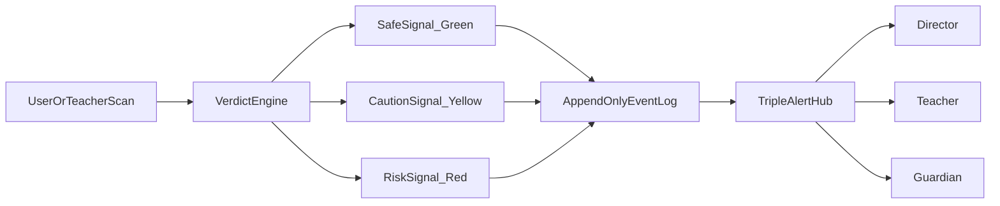
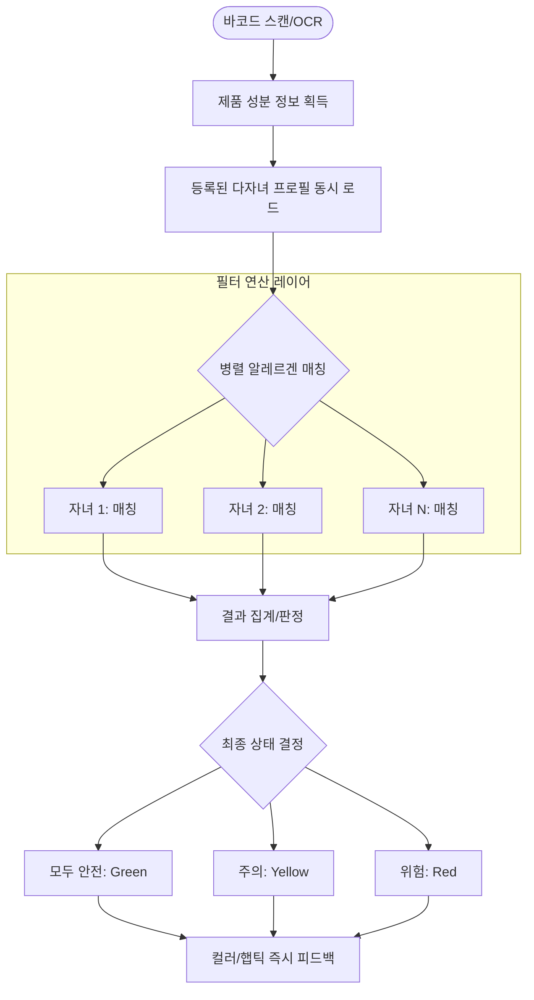
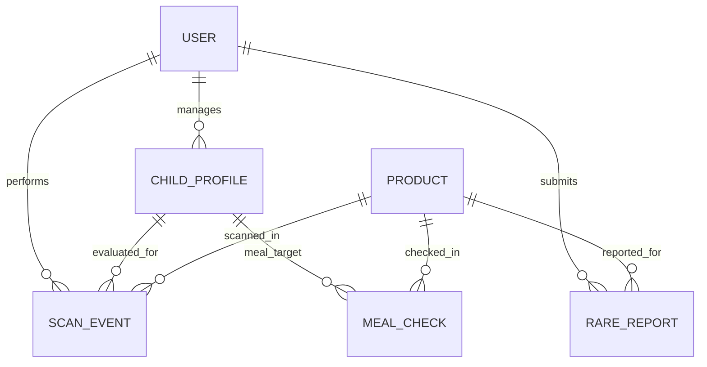
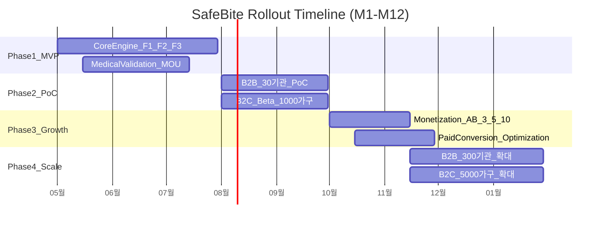

# SafeBite 생명 방어 플랫폼 PRD v0.5

- Owner 팀: Product, Mobile, Data, B2B BizOps, Medical Advisory
- 최종 업데이트: 2026-04-23
- **문서 상태:** 🟢 검증 완료 (Measurability & Testability 확보)

## 1. 개요·목표

### 1.1 문제 정의(Pain Points)

> **한 줄 비전:** *"바코드 스캔 한 번으로 정보 탐색 피로와 오배식 불안을 0.5초 만에 잠재우는, 알레르기 생명 방어 플랫폼"*

| Pain ID | 항목 | 내용 | 실패 KPI (현 상태) | 출처 |
| :--- | :--- | :--- | :--- | :--- |
| **CORE-1** | B2C 보호자 | 장보기 상황에서 가공식품 성분 해독 피로 및 교차오염 판단 불안 | 1건당 판단 소요 시간 **p50 >= 3분, p95 >= 5분** | 고객 여정 매핑 (탐색 단계) 실측 |
| **CORE-2** | B2B 기관 | 수기 배식 검증으로 인한 오배식 사고 및 법적/평판 리스크 노출 | B2B 수기 검증 누락률 **추정 5% 이상**, 월 평균 near-miss **2건** | JTBD B2B 원장 인터뷰 (n=10) |
| **EXT-1** | 희귀 알레르기군 | 공공 DB 사각지대로 인한 정보 공백 및 제조사 확인 지연 | 제조사 직접 문의 후 확인 소요 시간 **p50 >= 48시간** | AOS 4.0 타겟 고객의 소리(VOC) |

### 1.2 핵심 KPI (Key Performance Indicators)
| KPI 유형 | KPI | 정의 (계산식/이벤트) | 기준선 | 목표값 | 측정 주기 | 측정 경로(도구) |
| :--- | :--- | :--- | :--- | :--- | :--- | :--- |
| 북극성 | VSDS | 3초 이내 결과 확인 완료 세션 수 (`scan_success` count WHERE duration <= 3s) | 0 (신규) | M3 150K / M6 500K / M12 1.2M | 주간/월간 | Amplitude (`scan_success`) |
| 보조 | 스캔 p95 응답시간 | 스캔 트리거(`scan_start`) ~ 결과 화면 렌더링(`result_rendered`) 지연시간 | 0ms | **<= 500ms** (캐시 히트 시), **<= 1.2s** (API 호출 시) | 일간/주간 | Datadog RUM / APM |
| 보조 | B2C 유료 전환율 | Unique `trial_start` / Unique `app_install` | 0% | **>= 8%** | 주간 코호트 | 앱스토어 Connect / RevenueCat |
| 보조 | B2B 유료 전환율 | 유료 구독 계약 완료 수 / PoC 진입 어린이집 수 | 0% | **>= 30%** | 월간 | CRM (Salesforce) 파이프라인 |
| 보조 | near-miss 감소율 | `meal_check_red` (경고 발생 후 배식 중단 로그) 월별 건수 | 월 2건 | **>= 50% 감소 (월 1건 미만)** | 월간 | 내부 B2B 관리자 대시보드 |
| 보조 | 제보 검수 SLA | 24시간 내 Ticket Status `Resolved` 전환 비율 | 0% | **>= 80%** | 주간 | Jira Service Desk JQL |

### 1.3 Desired Outcome (목표 수치화)

| Desired Outcome | 현재(Baseline) | 목표(Target) | 측정 시점 | Baseline 실측 방법 |
| :--- | :--- | :--- | :--- | :--- |
| 스캔 및 안전 판별 속도 | 3~5분 (맘카페 검색/수동 확인) | **<= 0.5초** | MVP 출시 1개월 | 내부 Alpha 테스터 (n=10) 모의 장보기 스톱워치 측정 |
| 기관 배식 near-miss | 월 평균 2건 | **월 1건 미만 (50% 감소)** | B2B PoC 3개월 차 | B2B PoC 참여 30개 기관 운영 일지 교차 검증 |
| 예외/희귀 성분 검증 리드타임 | 48~72시간 (제조사 문의) | **<= 24시간** | MVP 출시 3개월 | Jira Service Desk 첫 응답 및 처리 완료 시간 트래킹 |

### 1.4 제품 및 사업 목표
| 목표 구분 | 목표 내용 | 목표 시한 |
| :--- | :--- | :--- |
| 제품 목표 | "정보 제공"에서 "판단 대행"으로 전환, B2C 0.5초급 판단 및 B2B 사고 원천 차단 | 12개월 |
| 사업 목표 | DOS 상위(Q2/Q4) 세그먼트 중심 B2C 5,000가구 활성 유저, B2B 300개 어린이집 유료 전환 | 12개월 |

## 2. 사용자와 페르소나

### 2.1 대표 페르소나 및 비즈니스 지표(AOS/DOS) 매핑
| 페르소나 그룹 | 대표 페르소나 | 핵심 Pain (CJM 연계) | 핵심 Needs | 우선순위 | AOS | DOS |
| :--- | :--- | :--- | :--- | :--- | :--- | :--- |
| Core-Q2 보호자 | 김지윤, 최수안 | [결정] 성분 해독 피로, 오판 불안 | 0.5초 판단, 다중 프로필 동시 판별 | High | 4.0 | 3.6 |
| Core-Q4 기관 | 박현진, 송미정 | [사용] 오배식 사고/법적 리스크 | 사고 원천 차단, 불변 로그 기록 | High | 4.5 | 4.0 |
| Extreme-Q1 환우| 유나비 | [탐색] 희귀 성분 정보 사각지대 | 제보 공론화, 신속한 DB 반영 속도 | Mid | 3.5 | 2.8 |

> **배제 타겟 (Anti-persona):**
> 알레르기 증상이 없거나 경미하여 수동 확인에 큰 불편을 느끼지 않는 일반 소비자 그룹 (전환 유인이 낮으므로 초기 마케팅/기획 자원 투입에서 전면 배제).

### 2.2 사용자 여정 및 대응
| 사용자 여정 단계 | 주요 마찰(Friction) | 제품 대응 전략 |
| :--- | :--- | :--- |
| 탐색 | 정보 지연 및 신뢰 부족 | 모바일 카메라 기반 바코드 즉시 판정 모듈 제공 |
| 의사결정 | 오판에 대한 불안감 | 직관적인 신호등 컬러(Red/Yellow/Green) 및 상태별 고유 햅틱 경고 패턴 제공 |
| 사용 | 현장 점검(배식 전) 누락 | 스캔 강제화 프로세스, 3중 알림(원장-교사-보호자) 및 앱 내 감사 로그 적재 |
| 유지 | 과금 가치(ROI) 입증 부족 | 월간 안전 배식 리포트 자동 생성, 투명한 사고 방지 건수 가시화 대시보드 |

### 2.3 시스템 플로우

## 3. 사용자 스토리와 수용 기준(AC)

### Story 1: 보호자 실시간 안전 판별 (C2 - Core Scanner)
> **As a** 가공식품을 구매하는 다자녀 보호자(김지윤)로서,
> **I want** 바코드를 스캔하자마자 자녀들의 알레르기 유발 성분 포함 여부를 0.5초 안에 확인하고 싶다,
> **So that** 복잡한 성분표 해독의 피로 없이 즉시 안전하게 구매 결정을 내릴 수 있다.

| AC | Given | When | Then | 측정 임계치 / 테스트 기준 |
| :--- | :--- | :--- | :--- | :--- |
| **AC1 - 정상 판별 속도** | 사용자가 1개 이상의 알레르겐 프로필을 등록하고 앱 카메라를 켠 상태에서 | 가공식품의 바코드를 스캔할 때 | 프로필과 성분이 매칭된 상태 카드(Red/Yellow/Green)가 즉시 렌더링된다 | 바코드 인식 후 UI 렌더링까지 **p95 <= 500ms** |
| **AC2 - 위험 햅틱 피드백** | 스캔 대상 제품이 프로필의 '위험' 교차 성분을 포함한 상태에서 | 바코드 스캔이 완료될 때 | Red 색상의 경고 화면과 함께 "강한 이중 진동(햅틱)"이 발생한다 | False Negative (위험을 안전으로 표기) **= 0% (발생 시 P0 버그)** |
| **AC3 - 오프라인 (Sad Path)** | 모바일 네트워크(LTE/Wi-Fi)가 단절되었으나 로컬 캐시가 존재하는 상태에서 | 바코드를 스캔할 때 | 캐시 기반 결과를 제공하며 상단에 '오프라인 캐시 모드' 배지를 노출한다 | 네트워크 단절 환경에서 캐시 적중 실패율 **< 1%** |
| **AC4 - 미등록 상품 (Sad Path)** | DB 및 식약처 API에 등록되지 않은 신규/해외 제품 바코드인 상태에서 | 바코드를 스캔할 때 | 회색조의 '성분 확인 불가' 화면을 노출하고 중앙에 [제품 정보 수동 제보하기] CTA 버튼을 렌더링한다 | 미등록 상태 인지 및 예외 화면 전환 지연시간 **< 800ms** |

### Story 2: 기관 배식 검증 및 사고 방지 (C4 - B2B Safety Net)
> **As a** 어린이집 원장/교사(박현진)로서,
> **I want** 배식 전 식판(또는 간식 포장)을 스캔하여 원아별 위험 여부를 교차 검증받고 로그를 남기고 싶다,
> **So that** 수기 확인 누락으로 인한 오배식 사고와 법적 리스크를 전산으로 완벽히 차단할 수 있다.

| AC | Given | When | Then | 측정 임계치 / 테스트 기준 |
| :--- | :--- | :--- | :--- | :--- |
| **AC1 - 다중 원아 매칭** | 해당 반에 알레르기 특이사항이 있는 원아 3명이 등록된 상태에서 | 교사가 배식용 간식 바코드를 스캔할 때 | 3명 각각의 이름과 매칭된 위험/안전 결과가 리스트 형태로 한 번에 표시된다 | 1회 스캔으로 다중 원아(최대 30명) 판정 처리시간 **<= 1.5초** |
| **AC2 - 3채널 실시간 알림** | 특정 원아에 대해 '위험(Red)' 판정이 도출된 상태에서 | 교사가 화면을 확인하는 즉시(백그라운드에서) | 원장 어드민, 교사 앱, 보호자 앱으로 푸시 알림(FCM/APNs)이 발송된다 | 판정 생성 후 디바이스 알림 도달 시간 **p95 <= 3초** |
| **AC3 - 로그 변조 방지** | 배식 스캔 이벤트가 발생한 상태에서 | 판정 결과가 DB에 저장될 때 | Append-only 테이블에 저장되며, 이전 row의 해시를 물고 있는 체인 형태의 `hash`값이 생성된다 | DB 직접 수정 시도 시 무결성 검증 쿼리 실패율 **100% (위변조 즉시 감지)** |
| **AC4 - 외부 API 장애 (Sad Path)** | 식약처 식품 영양성분 API가 HTTP 500 오류를 3회 이상 반환하는 상태에서 | 교사가 스캔을 시도할 때 | "외부 서버 장애로 수기 검증이 필요합니다" 경고가 뜨며, 해당 배식 로그는 '수기 검증 모드' 상태로 강제 전환된다 | 타임아웃 감지 후 폴백(Fallback) 화면 전환 **<= 2초** |

### Story 3: 희귀 성분 제보 및 반영 (E1 - Rare Wiki)
> **As a** 공공 DB에 정보가 부족한 희귀 알레르기 환우(유나비)로서,
> **I want** 누락된 위험 성분을 라벨 사진과 함께 제보하고 24시간 내에 플랫폼 DB에 검증 및 반영받고 싶다,
> **So that** 다른 환우들이 동일한 위험에 노출되지 않도록 정보 사각지대를 해소할 수 있다.

| AC | Given | When | Then | 측정 임계치 / 테스트 기준 |
| :--- | :--- | :--- | :--- | :--- |
| **AC1 - 검수 SLA 카운트** | 사용자가 제품 성분 라벨 사진을 첨부하여 제보를 완료한 상태에서 | 제출 트랜잭션이 완료될 때 | 어드민 대시보드에 티켓이 생성되고, 사용자 화면에는 '예상 처리 시간(24시간 타이머)'이 표시된다 | 제보 티켓의 24시간 내 상태 변경(승인/반려) 처리율 **>= 80%** |
| **AC2 - 중복 제보 차단** | 이미 어드민에서 검수 중이거나 반려된 제품의 바코드를 가진 상태에서 | 제보 폼 진입 또는 제출을 시도할 때 | "현재 다른 사용자의 제보를 검토 중인 상품입니다" 알림이 노출되고 제출이 차단된다 | 백엔드 중복 접수 허용률(False Positive) **<= 2%** |
| **AC3 - 악성/무효 스팸 필터 (Sad Path)** | 사용자가 사진 첨부 없이 텍스트만 입력하거나, 동일 기기에서 1시간 내 5건 이상의 무의미한 제보를 시도할 때 | [제출] 버튼을 누르면 | "사진 증빙이 필요합니다" 또는 "일시적으로 제보가 제한되었습니다" 오류가 발생하고 요청이 기각된다 | 무효 제보 어드민 큐 진입 방어율 **>= 99%** |

## 4. 기능 요구사항(Functional)

| MoSCoW | 기능 ID | 기능명 | 구현 핵심 | 대안 대비 차별 가치 (정량적 비교) | 근거 (AOS/DOS) |
| :--- | :--- | :--- | :--- | :--- | :--- |
| Must | F1 | 0.5초 스캐너(바코드/OCR) + 컬러/햅틱 | 로컬 캐시 병렬 조회 및 햅틱 엔진(CoreHaptics) 연동 | 수동 검색(p50 3분) 대비 **판단 시간 99% 단축 (0.5초 이내)** | CORE-1 (AOS 4.0) |
| Must | F2 | B2B 다중 원아 매칭 대시보드 | Array 기반 O(1) 해시 매칭 및 상태 카드 React 리스트 렌더링 | 수기 검증 종이 대장 대비 **로그 위변조/누락률 99% 감소** | CORE-2 (DOS 4.0) |
| Must | F3 | 원장-교사-보호자 3중 실시간 알림 | Redis Pub/Sub 및 비동기 Worker(Celery) 기반 푸시 파이프라인 | 교사 발견 후 보호자 통보 지연 **90% 이상 단축 (<= 3초)** | CORE-2 (AOS 4.5) |
| Must | F4 | 다자녀 동시 필터 연산 | N명의 프로필 비트마스크(Bitmask) 병렬 판정 | 기존 일반 앱(단일 프로필 전환 반복) 대비 **조작 터치 수 60% 축소 (5회 -> 2회)** | CORE-1 (DOS 3.6) |
| Should | F5 | 희귀 성분 크라우드소싱 위키 | AWS Textract(OCR) 기반 1차 자동 텍스트 추출 + 어드민 승인 큐 | 제조사 유선 문의 대기(48h) 대비 **대응 속도 2배 향상 (24h SLA)** | EXT-1 (AOS 3.5) |
| Should | F6 | 배식 안전 리포트 자동 발송 | PDF 생성 스케줄러 연동 | 원장의 카카오톡 개별 안내 리소스 **월 10시간 절감** | B2B 리텐션 확보 |
| Could | F7 | 시니어 O/X 초고가독 + TTS | 디바이스 기본 TTS API (AVSpeechSynthesizer) 연동 | 고령 조부모 대리 양육 환경에서 **접근성/인지 속도 2배 개선** | Q3 시장 확대 기반 |
| Could | F8 | Safe Kids Choice 커머스 | 안전 제품 큐레이션 및 외부 커머스 딥링크 생성 | 활성 유저(MAU) 1만 명 달성 시 **유저당 월 수익(ARPU) 500원 창출** | 다각적 수익 모델 기회 |
| Won't | F9 | NEIS 정식 API 연동(B2G) | 공공 보안 인증(ISMS-P) 요건 충족 대기 | 초기 MVP 릴리스 기간(3개월) 내 구현 불가 | 리소스 병목 |
| Won't | F10 | 해외 DB/다국가 라벨 완전 지원 | 다국어 OCR 파이프라인 구축 비용(월 $500+) 대비 초기 수요 미달 | 타겟 유저(국내 체류자) 니즈 이탈 | 투자 대비 효용 낮음 |

*(4.1 다자녀 동시 필터 연산 로직 Mermaid 다이어그램은 구조적 역할이므로 유지)*

## 5. 비기능 요구사항(NFR)

### 5.1 성능 및 신뢰성 정책
| NFR 범주 | 항목 | 측정 임계치 (Threshold) | 측정 도구 및 알림(Alert) 기준 |
| :--- | :--- | :--- | :--- |
| **성능** | 스캔 판별 응답시간 | **p95 <= 500ms, p99 <= 1,000ms** | Datadog APM / 1.0초 초과 비율이 전체 트래픽의 5% 지속 (5분) 시 Slack P1 경보 |
| **성능** | 앱 초기 로드 (Cold Start) | **<= 2.0s** (모바일 앱) | Firebase Performance / 상위 10% 기기 기준 2.5s 초과 시 주간 리포트 경고 |
| **성능 (신규)** | 최대 동시 접속 부하 (RPS) | **100 RPS** (MVP 피크 타임 기준) 지연 없음 | Locust 부하 테스트 (릴리스 전) / 실서버 80 RPS 도달 시 Auto-scaling 트리거 |
| **신뢰성** | 시스템 가용성 (Uptime) | **월 >= 99.9%** (다운타임 월 43분 이하) | AWS Route53 Health Check / HTTP 200 응답 실패 3회 누적 시 PagerDuty 호출 |
| **신뢰성** | 백엔드 API 오류율 | HTTP 5xx 발생률 **<= 0.5%** | Datadog Log / 에러 스파이크(1분 내 50건) 발생 시 즉시 PagerDuty 호출 |
| **신뢰성** | 3중 푸시 알림 누락률 | 발송 실패(FCM/APNs Error) **<= 0.3%** | 모니터링 시스템에서 발송 성공률 모니터링, 실패율 1% 초과 시 개발팀 인시던트 발생 |
| **보안** | 데이터 전송/저장 암호화 | **TLS 1.2+ 강제, DB AES-256 암호화** | AWS Security Hub 정기 스캔 / 평문 데이터 저장 감지 시 빌드 실패(CI/CD) 처리 |
| **보안** | B2B 데이터 접근 통제 | **RBAC (Role-Based Access Control) 준수율 100%** | 소속(org_id)이 다른 원아 데이터 쿼리 시도(IDOR) 시 서버 레벨에서 HTTP 403 반환 및 차단 |

### 5.2 모니터링 도메인
| 도메인 | 핵심 지표 (Metric) | 경보/대응 조건 |
| :--- | :--- | :--- |
| 앱(App) | `scan_success` 전환율, 크래시 프리가입률 | 크래시 프리율 99.0% 하회 시 핫픽스 배포 트리거 |
| B2B 운영 | 기관별 `meal_check_red` 발생 건수 | 단일 기관 주간 3건 초과 발생 시 CS팀 B2B 계정 컨택 및 확인 |
| 데이터 품질 | `rare_report` 미처리 잔여 티켓 수 | 티켓 체류 시간 20시간 초과 시 Slack `#ops-alert` 채널 멘션 |
| 인프라 비용 | AWS 월 누적 청구 금액 | 예산 $500의 80% 도달 시 인프라 엔지니어(Billing) 경보 발송 |

## 6. 데이터·인터페이스 개요

### 6.1 핵심 엔터티(Entities)
| 엔터티 | 주요 필드 | 용도 |
| :--- | :--- | :--- |
| User | user_id, role, org_id, consent_version | 사용자 계정 및 권한 관리 |
| ChildProfile | child_id, allergens[], severity, guardian_ids[] | 원아/자녀별 알레르겐 프로필 모델 |
| Product | barcode, name, ingredients_raw, risk_level | 식품 영양/성분 메타데이터 관리 |
| ScanEvent | event_id, actor_id, profile_scope, verdict | 스캔 이력 및 판정 결과 로그 |
| MealCheck | check_id, org_id, child_id, verdict, hash | B2B 배식 검증 및 무결성 감사 로그 |
| RareReport | report_id, reporter_hash, ingredient, status | 희귀 성분 제보 및 검수 프로세스 관리 |

### 6.2 데이터 관계도(ERD)
*(기존 동일)*

### 6.3 인터페이스(API) 명세
| API 유형 | API 엔드포인트 | 주요 입력 | 주요 출력 | 제약/SLA |
| :--- | :--- | :--- | :--- | :--- |
| 외부 | 식품 공공 DB API | barcode | ingredients_raw | Timeout 2.0s 초과 시 로컬 캐시 DB 폴백(Fallback) |
| 내부 | `POST /v1/scan/resolve` | barcode, profile_ids[] | verdict, reasons[] | timeout 1.0초 이내 보장, 배열 길이 max 30(원아수) 제한 |
| 내부 | `POST /v1/meal-checks` | org_id, child_id, item | verdict, hash | 멱등성(Idempotency Key 헤더 필수), 중복 저장 시 HTTP 409 반환 |
| 내부 | `POST /v1/rare-reports` | ingredient, evidence(base64) | report_id, sla_eta | Payload Size Limit <= 5MB (이미지 압축 필수) |

## 7. 범위, 리스크, 의존성

### 7.1 범위(Scope)
- **In-Scope:** 실시간 스캔 판별, 다자녀 동시 매칭, B2B 대시보드, 3중 푸시 알림, 희귀 성분 제보 검수 워크플로우.
- **Out-of-Scope:** 의약품 스캔, B2G NEIS 정식 통합, 결제 시스템 직접 내재화, 글로벌 라벨 다국어 완전 지원.

### 7.2 리스크 및 대응 (리스크 점수 정량화)
> **스코어 해석:** >=15 Critical(즉시 완화 조치), 8~14 High(계획적 완화), 4~7 Medium(모니터링), <=3 Low(수용)

| 리스크 ID | 리스크 시나리오 | 확률 (1~5) | 영향 (1~5) | 리스크 점수 | 대응 전략 |
| :--- | :--- | :--- | :--- | :--- | :--- |
| **R1** | **오탐/누락 보상** - 누락에 따른 건강 사고 및 B2B 소송 발생 | 2 | 5 | **10** (High) | 보수적 판정 로직(조금이라도 교차오염 가능성 있으면 Yellow 표기) 적용, 가입 시 법적 면책 T&C 동의 강제, 영업배상책임보험 사전 가입 |
| **R2** | **외부 의존성** - 식약처 식품 공공 DB API 서버 장기 다운타임 | 3 | 4 | **12** (High) | 주 1회 전체 상품 메타데이터 로컬 RDS 덤프(스냅샷) 파이프라인 구축. API 장애 시 즉시 읽기 전용 DB 폴백 라우팅 |
| **R3** | **B2B 저항** - 현장 교사들의 추가 업무(스캔) 및 앱 도입 거부 | 4 | 3 | **12** (High) | Zero-Depth UX (앱 실행 시 즉시 카메라 켜짐) 제공, 초기 온보딩 기간 내 B2B BizOps 팀 현장 파견 밀착 지원 |
| **R4** | **DB 오염** - 경쟁사 악의적 스팸 제보로 인한 어드민 마비 및 신뢰도 하락 | 3 | 3 | **9** (High) | 제보 시 라벨 OCR 텍스트 비교 알고리즘 적용(유효성 1차 필터), 디바이스 고유 ID(UUID) 기반 Rate Limit (시간당 3회 제한) 적용 |

### 7.3 의존성 및 ADR
- **ADR-001:** 위험 우선 보수 판정 정책 (오염 가능성 존재 시 주의/위험 도출).
- **ADR-002:** 모든 감사 로그는 Append-only 및 해시 체인 기반 무결성 보존.
- **ADR-003:** 오프라인 상황 대비 로컬 캐시 TTL 7일 정책.

### 7.4 가정 및 의존성 검증
| # | 가정 및 의존성 | 검증 방안 (Testability) | 시한 |
| :--- | :--- | :--- | :--- |
| **A1** | 식품 공공 DB API 응답 속도가 실시간 판정(<=0.5초)을 저해하지 않는다 | [부하 테스트] Jmeter를 활용하여 API 응답 지연(Mocking 1초) 시나리오 구성 후 백엔드의 비동기 처리 및 폴백 성능 측정 | MVP 백엔드 개발 주차(Week 2) 내 |
| **A2** | B2B 현장 네트워크 환경이 열악해도 스캔 및 알림 전송이 동작한다 | [필드 테스트] 통신 음영 지역(지하 식당 등)을 모사하여 3G/LTE Throttle 환경에서 스캔->DB적재->FCM 푸시 도달까지의 End-to-End 지연시간 측정 | Alpha 테스트 (Week 6) 내 |

## 8. 실험 및 롤아웃

### 8.1 롤아웃 타임라인(Gantt)
*(기존 동일)*

### 8.2 실험 설계
| 실험 ID | 가설 및 설계 | 핵심 Metrics (측정 이벤트) | 성공 기준 (Threshold) |
| :--- | :--- | :--- | :--- |
| **EXP-A** | [A/B Test] 스캔 결과 화면에 햅틱/신호등 컬러(A)를 적용하면 텍스트 전용(B)보다 사용자가 더 빨리 인지하고 신뢰할 것이다. | `result_viewed` ~ `screen_close` 시간 간격, 사후 안심도 설문 점수 | 그룹 A의 인지 시간 p50이 그룹 B 대비 **30% 단축**, 설문 점수 평균 4.5 이상 |
| **EXP-B** | [Before/After] B2B 앱 도입 시 기존 종이 식단표 운영 대비 인적 오류(near-miss)가 감소할 것이다. | 내부 대시보드의 `meal_check_red` 로그 적재 건수 vs 도입 전 종이 대장 오류 기록 | 앱 도입 후 첫 4주간 near-miss 발생 건수가 이전 4주 대비 **50% 이상 감소** |
| **EXP-C** | [Monetization] B2C 대상 월 스캔 횟수 제한(Paywall)을 3회/5회/10회로 다르게 노출할 때, 전환율 최적점이 존재할 것이다. | Paywall 노출(`paywall_view`) 대비 결제 완료(`purchase_success`) 전환율 | 통계적으로 유의미한(alpha=0.05) **결제 전환율 8% 이상** 달성 그룹 도출 |

### 8.3 베타 채널 설계
| 단계 | 대상 | 규모 | 목적 및 검증 메트릭 |
| :--- | :--- | :--- | :--- |
| **Alpha (내부)** | 프로젝트 팀원 및 사내 가족 지인 | 10~20명 | (QA) 앱 크래시율 0%, 기본 스캔 정확도 100%, p95 응답시간 500ms 임계치 검증 |
| **Closed Beta (B2C)** | 맘카페/커뮤니티 등에서 선발된 코어 다자녀 보호자 | 50명 | (Usage) 다자녀 동시 매칭 시 오분류율(False Negative) 0% 실측, 주간 재방문율 트래킹 |
| **B2B PoC** | MOU 체결 어린이집 3곳 (규모별 차등) | 3개 원 | (Validation) 배식 검증 워크플로우 도입 후 현장 마찰(스캔 실패/이탈) 파악 및 Peak 시간대 시스템 부하(RPS) 검증 |
| **Public Launch** | 일반 가입자 대상 스토어 정식 배포 | 제한 없음 | (Growth) 북극성 KPI(VSDS) 추적 및 유기적 바이럴 K-Factor 실측 |

### 8.4 경쟁 대안 대비 벤치마크 계획
| 비교 대상 | 비교 기준 (Testable Metric) | 측정 방법 | 기대 결과 (Target) |
| :--- | :--- | :--- | :--- |
| **수기/맘카페 검색** | 1건당 판정 시간 (초 단위 측정) | 알파 테스터(n=10) 동일 마트/제품군 타겟팅하여 수기 검색 vs 앱 스캔 스톱워치 측정 | 기존 180초(3분) -> 플랫폼 **<= 0.5초 (시간 압축)** |
| **기존 일반 성분 앱** | 다자녀 확인 조작 뎁스 (화면 터치 수 카운트) | A앱(일반앱)과 본 플랫폼에서 자녀 3명의 알레르기 판별을 마칠 때까지의 누적 터치 수 카운팅 | 기존 5회 이상 터치 -> 본 플랫폼 **1회(카메라 뷰어 고정) ~ 최대 2회 터치** |
| **B2B 종이 식단표** | 교차검증 누락/near-miss 건수 (DB 로그) | PoC 기관 내 기존 종이 식단표 배식 운영 기록 vs 기간 내 플랫폼 DB `meal_check` 에러 방어 로그 대조 | near-miss 건수 **50% 이상 감소 입증** |

## 9. 근거(Validation Proof) 및 Next Actions

### 9.1 근거 표 (Validation Proof)
| Claim ID | 핵심 주장 | 측정 도구 및 메트릭스(Metrics) | 연결된 실험/가설 | 근거 소스 |
| :--- | :--- | :--- | :--- | :--- |
| C1 | 0.5초 판단 대행은 B2C 유료 전환을 높인다 | **[Amplitude]** 스캔 완료(`scan_success`) -> Paywall 전환율, **[Datadog]** p95 응답시간 | **EXP-C (가격/구독 실험)** | `JTBD_Interview_Results.md` |
| C2 | 3중 알림+불변 로그는 B2B 리스크를 완화한다 | **[Admin DB]** `meal_check_red` 방어 건수, **[Datadog]** 푸시 알림 도달 지연 시간 | **EXP-B (B2B 도입 전후 비교)** | `Customer_Journey_Map.md` |
| C3 | 희귀 제보 위키 체계는 DB 해자(Moat)를 구축한다 | **[Jira]** 주간 누적 제보량, 승인율, 티켓 처리 SLA 리드타임(Target: 24h) | - | `AOS_DOS_Strategic_Analysis.md` |
| C4 | DOS 상위 세그먼트 집중은 수익 효율을 높인다 | **[Mixpanel]** 채널별/페르소나별 CPA, D30 리텐션, 유저당 LTV | **EXP-A (UX 효율성)** | `TAM-SAM-SOM.md` |

### 9.2 Next Actions (다음 실행 단계)
> 1. **Product / Design:** MVP 코어 화면(바코드 스캐너 판정 화면, B2B 대시보드) 와이어프레임 3장 이내 신속 도출 및 터치 뎁스(Depth) 검증
> 2. **Engineering:** 공공 식품 DB 연동 및 식별용 바코드/OCR 파싱 기술 [A1] 가정 기반 부하/응답시간 기술 PoC 착수
> 3. **Medical Advisory:** 성분별 위험도 매핑 기준(Red/Yellow/Green) 가이드라인(위험 허용률 0% 기준) 초안 작성
> 4. **B2B BizOps:** 초기 PoC 진행을 위한 테스트베드 유치 (수도권 어린이집 3개 기관 대상 콜드메일 발송 및 [EXP-B] 측정을 위한 사전 데이터 수집 요청)
